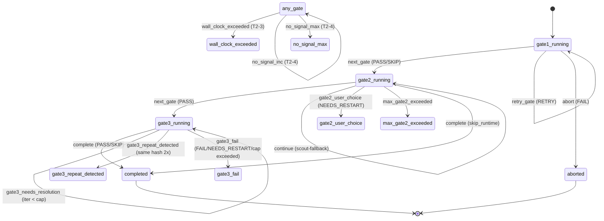

# qg Tier 2/3 개선 — 구현 계획 (Implementation Plan)

> **For agentic workers:** REQUIRED SUB-SKILL: Use `superpowers:subagent-driven-development` (recommended) or `superpowers:executing-plans` to implement this plan task-by-task. Steps use checkbox (`- [ ]`) syntax for tracking.

**Goal:** Tier 1 (`v1.16.0`)가 도입한 안전 가드와 문서 정렬 위에서, **constitution↔code drift를 닫고 silent-skip을 loud-skip으로 격상하며 deterministic layer를 script로 내려** quality-gates를 `v1.30.0` 상한까지 견고화한다.

**Architecture:** 본 plan은 *14개 독립 PR* 로 구성. Order of Land는 (1) stuck-state safety(T2-3/T2-4) → (2) trivia 확장(T2-1) → (3) Phase 1 단일 dispatch + 게이트 통합(T2-2/T3-5) → (4) parallel quality-of-life fixes(T2-5..T2-9; T2-8→T2-9 sequencing) → (5) test harness prerequisite(T3-4 stub) → (6) deterministic refactor(T3-3/T3-2/T3-1) → (7) behavioral test backfill(T3-4). 각 PR은 plugin.json minor bump + CHANGELOG entry + "Principles Instantiated" 갱신을 동반.

**Tech Stack:** Python 3 (stop-hook, pytest), Bash (scripts, *.sh tests), Mermaid (state diagram), YAML (agent frontmatter, fixture). 새 dependency 없음.

**Spec source:** `docs/superpowers/specs/2026-05-17-qg-tier2-3-improvements-design.md` (commit `c23b8c0`, PR #44).

**Three Laws 적용**:
- Law 1 (Clarity Before Code): 각 PR은 AC# 매핑된 fixture 기반 test가 *먼저* land.
- Law 2 (Writer/Reviewer 분리): 새 script들은 SKILL.md frontmatter Bash allowlist에 *좁게* 등록 (`Bash(${CLAUDE_PLUGIN_ROOT}/scripts/<exact>:*)`), `Bash(*)` 금지.
- Law 3 (Compounding): 각 PR이 CHANGELOG + Principles Instantiated 항목을 *반드시* 추가 — 미래 search가 모든 변경을 찾아냄.

---

## 사전 준비 (모든 PR 공통)

각 PR 시작 시:

- [ ] **Pre-A: 브랜치 생성**

```bash
git fetch origin
git checkout main
git pull origin main
git checkout -b feature/qg-<short-name>   # 예: qg-wall-clock-budget
```

- [ ] **Pre-B: 현재 quality-gates 버전 확인**

```bash
grep '"version":' plugins/quality-gates/.claude-plugin/plugin.json
```

- [ ] **Pre-C: 테스트 baseline 확인 (현재 100% green이어야 함)**

```bash
bash -c '
set -e
for f in plugins/quality-gates/tests/test_*.sh; do
  bash "$f" >/dev/null
done
python3 -m pytest plugins/quality-gates/tests/test_*.py -q
echo "baseline green"
'
```

기대: `baseline green` 출력. 1개라도 fail이면 PR 시작 금지 — 먼저 baseline 회복.

각 PR 마무리 시:

- [ ] **Post-A: plugin.json version bump** (minor 권장; pure refactor patch 가능)

```bash
# 예: 1.16.0 → 1.17.0
# (Read first, then Edit)
```

- [ ] **Post-B: CHANGELOG entry** 추가 (`## [x.y.z] — YYYY-MM-DD`, Added/Changed/Removed/Security 분리)

- [ ] **Post-C: README "Principles Instantiated" 항목 갱신** (관련 Law/원칙 한 줄 추가)

- [ ] **Post-D: 전체 회귀 검증** (`bash`/`pytest`/`gh pr create`)

---

## Task 1 — T2-3: Pipeline wall-clock budget

**Files:**
- Modify: `plugins/quality-gates/hooks/stop-hook.py:285-402` (`compute_transition` 직후 module-level helper 추가), `plugins/quality-gates/hooks/stop-hook.py:846-1015` (`main()` 흐름 단계 4 신설)
- Modify: `plugins/quality-gates/scripts/setup-qg.sh:190-294` (env override + state frontmatter `wall_clock_deadline_at`)
- Modify: `plugins/quality-gates/README.md` (§설정 `### Tuning knobs` 표에 `DEVBREW_QG_DEADLINE_MIN` 한 줄 추가)
- Test: `plugins/quality-gates/tests/test_stop_hook_state_machine.py` (5 new tests: AC10..AC14)
- Modify: `plugins/quality-gates/.claude-plugin/plugin.json` (1.16.0 → 1.17.0)
- Modify: `plugins/quality-gates/CHANGELOG.md`

**AC covered:** AC10, AC11, AC12, AC13, AC14.

### Step 1.1: 실패 테스트 5개 작성 (AC10–AC14)

- [ ] `plugins/quality-gates/tests/test_stop_hook_state_machine.py`의 맨 아래에 다음 클래스 추가:

```python
class TestWallClockBudget(unittest.TestCase):
    """T2-3: deadline_exceeded() pure helper + main() integration."""

    def test_AC10_exceeded_returns_true(self):
        from datetime import datetime, timezone
        state = {"wall_clock_deadline_at": "2026-05-17T12:00:00Z"}
        now = datetime(2026, 5, 17, 12, 0, 1, tzinfo=timezone.utc)
        self.assertTrue(stop_hook.deadline_exceeded(state, now=now))

    def test_AC11_not_exceeded_returns_false(self):
        from datetime import datetime, timezone
        state = {"wall_clock_deadline_at": "2026-05-17T12:00:00Z"}
        now = datetime(2026, 5, 17, 11, 59, 59, tzinfo=timezone.utc)
        self.assertFalse(stop_hook.deadline_exceeded(state, now=now))

    def test_AC12_missing_field_returns_false(self):
        # graceful — feature off semantics
        self.assertFalse(stop_hook.deadline_exceeded({}, now=None))

    def test_AC13_setup_disabled_by_env_writes_empty(self):
        # AC13: setup-qg.sh writes wall_clock_deadline_at as empty string
        # when DEVBREW_QG_DEADLINE_MIN=0. We test the contract that
        # parse_state_file accepts the empty string and deadline_exceeded
        # returns False.
        state = {"wall_clock_deadline_at": ""}
        self.assertFalse(stop_hook.deadline_exceeded(state, now=None))

    def test_AC14_main_integration_routes_to_wall_clock_exceeded(self):
        # AC14: deadline-exceeded state + any signal → transition
        # type == "wall_clock_exceeded" takes precedence over verdict mapping
        from datetime import datetime, timezone
        state = {
            "current_gate": 2, "gate2_iteration": 1, "max_gate2_iterations": 5,
            "skip_runtime": False, "single_gate": None,
            "wall_clock_deadline_at": "2026-05-17T11:00:00Z",
        }
        signal = {"gate": "2", "verdict": "PASS"}
        # Simulate main() flow: pure transition first, then deadline override
        base = stop_hook.compute_transition(state, signal)
        now = datetime(2026, 5, 17, 12, 0, 0, tzinfo=timezone.utc)
        if stop_hook.deadline_exceeded(state, now=now):
            transition = {"type": "wall_clock_exceeded", "prior": base}
        else:
            transition = base
        self.assertEqual(transition["type"], "wall_clock_exceeded")
```

- [ ] **Step 1.1.1: Run test to verify FAIL**

```bash
python3 -m pytest plugins/quality-gates/tests/test_stop_hook_state_machine.py::TestWallClockBudget -v
```

Expected: 5/5 FAIL with `AttributeError: module 'stop_hook' has no attribute 'deadline_exceeded'`.

### Step 1.2: `deadline_exceeded` helper 구현

- [ ] `plugins/quality-gates/hooks/stop-hook.py:285` 의 `# --- State Transitions ---` 라인 직전에 다음 module-level helper 추가:

```python
# --- Wall-clock budget (T2-3) ---

def deadline_exceeded(state, now=None) -> bool:
    """Pure helper: True iff state has a populated wall_clock_deadline_at
    that is strictly in the past relative to `now` (default: utc now).

    Returns False when:
    - the field is absent (legacy state, feature off),
    - the field is the empty string (DEVBREW_QG_DEADLINE_MIN=0 opt-out),
    - the field is malformed (defensive — feature off rather than abort).
    """
    deadline_str = state.get("wall_clock_deadline_at", "")
    if not deadline_str:
        return False
    try:
        # ISO 8601 with trailing Z; Python 3.11+ datetime.fromisoformat accepts Z.
        deadline = datetime.fromisoformat(deadline_str.replace("Z", "+00:00"))
    except (ValueError, TypeError):
        return False
    if now is None:
        now = datetime.now(timezone.utc)
    if deadline.tzinfo is None:
        deadline = deadline.replace(tzinfo=timezone.utc)
    return now > deadline
```

### Step 1.3: `main()`에 deadline 분기 추가

- [ ] `plugins/quality-gates/hooks/stop-hook.py:899-901` 의 `# 7. Compute state transition` 블록 *직후*, `# 8. Update state file` 블록 직전에 삽입:

```python
    # 7.5. Wall-clock budget override (T2-3). Pure compute_transition above
    # stays untouched; this is main()-only I/O against current clock.
    if deadline_exceeded(state):
        transition = {"type": "wall_clock_exceeded", "prior": transition}
```

- [ ] 같은 파일의 `_SPECIAL_PROMPTS` dict (L626 근처)에 새 항목 추가 (insertion point: `("gate2_user_choice", None)` 항목 직전):

```python
    "wall_clock_exceeded": {
        "header": "WALL_CLOCK_EXCEEDED",
        "body": (
            "Quality Gates exceeded the configured wall-clock budget.\n\n"
            "Present options to the user via AskUserQuestion:\n"
            "1. Extend budget — opt-in to continue (re-run /qg with "
            "DEVBREW_QG_DEADLINE_MIN larger or 0).\n"
            "2. Accept partial — emit verdict for the gate as-is.\n"
            "3. Abort — stop the pipeline.\n\n"
            "Based on user choice:\n"
            "- Extend: emit <qg-signal action=\"abort\" "
            "reason=\"User will re-run /qg with extended budget\" />\n"
            "- Accept partial: emit <qg-signal gate=\"{current_gate}\" "
            "verdict=\"PASS_WITH_WARNINGS\" summary=\"wall-clock exceeded; "
            "user accepted partial\" files_changed=\"\" />\n"
            "- Abort: emit <qg-signal action=\"abort\" "
            "reason=\"User chose to abort after wall-clock exceeded\" />\n"
        ),
    },
```

- [ ] `_SPECIAL_PROMPTS`의 `fmt` dict (`build_special_prompt` 안 L777-781)에 `current_gate` 추가:

```python
    fmt = {
        "max_gate2_iterations": state.get("max_gate2_iterations", 5),
        "gate3_resolution_iter": state.get("gate3_resolution_iter", 0),
        "max_gate3_resolutions": state.get("max_gate3_resolutions", 3),
        "current_gate": state.get("current_gate", 1),
    }
```

- [ ] `USER_CHOICE_TYPES` (L969 근처)에 `"wall_clock_exceeded"` 추가:

```python
    USER_CHOICE_TYPES = {
        "gate2_user_choice", "max_gate2_exceeded", "gate3_fail",
        "gate3_needs_resolution", "gate3_repeat_detected",
        "wall_clock_exceeded",
    }
    USER_CHOICE_TYPES_FOR_HINT = USER_CHOICE_TYPES  # 같은 set
```

- [ ] `build_system_message`의 user-choice 분기 (L801-803)에도 `"wall_clock_exceeded"` 포함:

```python
    if t_type in ("max_gate2_exceeded", "gate3_fail", "gate2_user_choice",
                  "gate3_needs_resolution", "gate3_repeat_detected",
                  "wall_clock_exceeded"):
        return "⚠️ Quality Gates: Action required | /cancel-qg to stop"
```

### Step 1.4: `setup-qg.sh`에 deadline state field 작성

- [ ] `plugins/quality-gates/scripts/setup-qg.sh:200` 근처 (`MAX_GATE3_RESOLUTIONS` 결정 직후) 아래 블록 추가:

```bash
# --- Wall-clock budget (T2-3) ---
RAW_DEADLINE_MIN="${DEVBREW_QG_DEADLINE_MIN:-30}"
if [[ ! "$RAW_DEADLINE_MIN" =~ ^[0-9]+$ ]]; then
  echo "⚠️  Quality Gates: DEVBREW_QG_DEADLINE_MIN='$RAW_DEADLINE_MIN' is not numeric; using default 30" >&2
  DEADLINE_MIN=30
else
  DEADLINE_MIN="$RAW_DEADLINE_MIN"
fi
if [[ "$DEADLINE_MIN" -eq 0 ]]; then
  WALL_CLOCK_DEADLINE=""
else
  # Compute deadline = now + DEADLINE_MIN minutes, ISO 8601 with Z.
  # macOS BSD date and GNU date use different flags; try both.
  if WALL_CLOCK_DEADLINE="$(date -u -v+"${DEADLINE_MIN}"M +%Y-%m-%dT%H:%M:%SZ 2>/dev/null)"; then
    :
  else
    WALL_CLOCK_DEADLINE="$(date -u -d "+${DEADLINE_MIN} minutes" +%Y-%m-%dT%H:%M:%SZ)"
  fi
fi
```

- [ ] L279-307의 `cat > "$TEMP_FILE" << EOF` heredoc 안에 새 line 추가 (위치: `started_at` 위):

```bash
wall_clock_deadline_at: "$WALL_CLOCK_DEADLINE"
```

### Step 1.5: README §설정 — `DEVBREW_QG_DEADLINE_MIN` 한 줄 추가

- [ ] `plugins/quality-gates/README.md`에서 `### Tuning knobs` 섹션의 env-var 표에 한 행 추가 (env-var 이름순):

```markdown
| `DEVBREW_QG_DEADLINE_MIN` | int (분) | `30` | Pipeline wall-clock budget. `0`이면 무한 (no-deadline 모드). 도달 시 user-choice prompt 발동. |
```

### Step 1.6: 테스트 재실행 — 5/5 PASS

- [ ] 명령:

```bash
python3 -m pytest plugins/quality-gates/tests/test_stop_hook_state_machine.py::TestWallClockBudget -v
```

Expected: 5 passed.

### Step 1.7: 회귀 — 기존 stop-hook 테스트 + 전체 sh 테스트

- [ ] 명령:

```bash
python3 -m pytest plugins/quality-gates/tests/test_stop_hook_state_machine.py -q
python3 -m pytest plugins/quality-gates/tests/test_stop_hook_unit.py -q
bash plugins/quality-gates/tests/test_setup_qg.sh
```

Expected: 모두 PASS (TestWallClockBudget 5 신규 + 기존 회귀 0 fail).

### Step 1.8: plugin.json + CHANGELOG + README "Principles Instantiated"

- [ ] `plugins/quality-gates/.claude-plugin/plugin.json` version: `1.16.0` → `1.17.0`

- [ ] `plugins/quality-gates/CHANGELOG.md` 상단에 추가:

```markdown
## [1.17.0] — 2026-05-17

### Added
- `DEVBREW_QG_DEADLINE_MIN` (default 30 min, `0`=disabled) — pipeline wall-clock budget. main() 흐름에서 `deadline_exceeded(state, now=None)` pure helper로 검사 후 `wall_clock_exceeded` user-choice transition emit. CLAUDE.md `P18 anti-corollary` 4-가드 중 누락되었던 wall-clock 추가 (T2-3).

### Changed
- `setup-qg.sh`: state frontmatter에 `wall_clock_deadline_at: "<ISO8601>"` 신설.
- `stop-hook.py`: `_SPECIAL_PROMPTS`에 `wall_clock_exceeded` entry, `USER_CHOICE_TYPES`에 동일 추가.
```

- [ ] `plugins/quality-gates/README.md`의 "Principles Instantiated" 섹션에 한 줄 추가:

```markdown
- **Law 1 (Clarity Before Code)** — `compute_transition()`이 pure로 유지되도록 `deadline_exceeded()`를 module-level helper로 분리. main()이 I/O를 격리.
```

### Step 1.9: Commit

```bash
git add plugins/quality-gates/hooks/stop-hook.py \
        plugins/quality-gates/scripts/setup-qg.sh \
        plugins/quality-gates/README.md \
        plugins/quality-gates/tests/test_stop_hook_state_machine.py \
        plugins/quality-gates/.claude-plugin/plugin.json \
        plugins/quality-gates/CHANGELOG.md
git commit -m "$(cat <<'EOF'
feat(quality-gates): wall-clock budget (T2-3, v1.17.0)

- Add module-level `deadline_exceeded(state, now=None)` pure helper to stop-hook.
- main() now inserts a deadline override branch between compute_transition()
  and update_state_file(), keeping compute_transition pure.
- setup-qg.sh writes `wall_clock_deadline_at` ISO8601 into state frontmatter,
  honoring DEVBREW_QG_DEADLINE_MIN (default 30, 0=disabled).
- New transition type `wall_clock_exceeded` lands in _SPECIAL_PROMPTS + the
  USER_CHOICE_TYPES allowlist so the user gets a 3-option intercept.
- 5 fixture tests cover AC10..AC14.

Closes T2-3. P18 anti-corollary 4-guard completion.

Co-Authored-By: Claude Opus 4.7 (1M context) <noreply@anthropic.com>
EOF
)"
```

- [ ] `git push -u origin feature/qg-wall-clock-budget` + `gh pr create --base main --title "feat(quality-gates): wall-clock budget (T2-3)" --body ...`

---

## Task 2 — T2-4: Stop-hook no-signal infinite re-injection counter

**Files:**
- Modify: `plugins/quality-gates/hooks/stop-hook.py:846-1015` (main() — no-signal branch)
- Modify: `plugins/quality-gates/scripts/setup-qg.sh:279-307` (state frontmatter `consecutive_no_signal: 0`)
- Modify: `plugins/quality-gates/README.md` §Tuning knobs (`DEVBREW_QG_NO_SIGNAL_MAX` 한 줄)
- Test: `plugins/quality-gates/tests/test_stop_hook_state_machine.py` (4 new tests: AC15..AC18, AC18b)

**AC covered:** AC15, AC16, AC17, AC18, AC18b.

**Depends on:** Task 1 (T2-3) — `wall_clock_exceeded` 전송로가 같은 USER_CHOICE_TYPES set에 있어야 함. Task 1 land 후 진행.

### Step 2.1: 실패 테스트 작성

- [ ] `test_stop_hook_state_machine.py` 맨 아래에 추가:

```python
class TestNoSignalCounter(unittest.TestCase):
    """T2-4: consecutive_no_signal counter prevents infinite re-inject."""

    def _base_state(self, consecutive_no_signal=0):
        return {
            "current_gate": 2, "gate2_iteration": 1, "max_gate2_iterations": 5,
            "skip_runtime": False, "single_gate": None,
            "consecutive_no_signal": consecutive_no_signal,
        }

    def test_AC15_inc_below_max(self):
        # state has counter=2, no signal arrives → "no_signal_inc" transition
        state = self._base_state(consecutive_no_signal=2)
        transition = stop_hook.compute_no_signal_transition(state, max_no_signal=3)
        self.assertEqual(transition["type"], "no_signal_inc")
        self.assertEqual(transition["new_count"], 3)

    def test_AC16_at_max_triggers_user_choice(self):
        # counter=3 + no_signal + max=3 → "no_signal_max" (user-choice intercept)
        state = self._base_state(consecutive_no_signal=3)
        transition = stop_hook.compute_no_signal_transition(state, max_no_signal=3)
        self.assertEqual(transition["type"], "no_signal_max")

    def test_AC17_valid_signal_resets_counter(self):
        # When a valid signal IS present, main() resets the counter to 0.
        # Use the helper that performs the reset.
        state = self._base_state(consecutive_no_signal=2)
        new_count = stop_hook.reset_no_signal(state)
        self.assertEqual(new_count, 0)

    def test_AC18_feature_off_when_max_zero(self):
        # DEVBREW_QG_NO_SIGNAL_MAX=0 disables the feature entirely.
        state = self._base_state(consecutive_no_signal=5)
        transition = stop_hook.compute_no_signal_transition(state, max_no_signal=0)
        # No user-choice prompt; just continue (re-inject as before)
        self.assertEqual(transition["type"], "continue")

    def test_AC18b_both_stuck_protections_off_yields_continue(self):
        # DEVBREW_QG_NO_SIGNAL_MAX=0 + DEVBREW_QG_DEADLINE_MIN=0 (no deadline field
        # OR empty string). No transition type "wall_clock_exceeded", no
        # "no_signal_max" — power user opt-out mode.
        state = self._base_state(consecutive_no_signal=100)
        state["wall_clock_deadline_at"] = ""
        transition = stop_hook.compute_no_signal_transition(state, max_no_signal=0)
        self.assertEqual(transition["type"], "continue")
        self.assertFalse(stop_hook.deadline_exceeded(state))
```

- [ ] Run, expect 5/5 FAIL:

```bash
python3 -m pytest plugins/quality-gates/tests/test_stop_hook_state_machine.py::TestNoSignalCounter -v
```

### Step 2.2: helper 구현

- [ ] `stop-hook.py:285` (T2-3에서 추가한 `deadline_exceeded` 직후) 다음 추가:

```python
# --- No-signal counter (T2-4) ---

def compute_no_signal_transition(state, max_no_signal):
    """Pure helper: decide what to do when no <qg-signal> emitted this turn.

    max_no_signal: env-derived bound (DEVBREW_QG_NO_SIGNAL_MAX). 0 disables.
    """
    if max_no_signal <= 0:
        return {"type": "continue"}
    cur = int(state.get("consecutive_no_signal", 0))
    new_count = cur + 1
    if new_count >= max_no_signal:
        return {"type": "no_signal_max", "new_count": new_count}
    return {"type": "no_signal_inc", "new_count": new_count}


def reset_no_signal(state) -> int:
    """Return the new consecutive_no_signal value after a valid signal (0)."""
    return 0
```

### Step 2.3: main()의 no-signal 분기 갱신

- [ ] `stop-hook.py:880-897` (현재 `if not signal: ... re-inject current gate prompt` 블록) 교체:

```python
    # 6. If no signal found, increment consecutive_no_signal and decide.
    raw_max = os.environ.get("DEVBREW_QG_NO_SIGNAL_MAX", "3")
    try:
        max_no_signal = int(raw_max)
    except (ValueError, TypeError):
        print(f"⚠️  Quality Gates: DEVBREW_QG_NO_SIGNAL_MAX='{raw_max}' "
              "is not numeric; defaulting to 3.", file=sys.stderr)
        max_no_signal = 3

    if not signal:
        ns_transition = compute_no_signal_transition(state, max_no_signal)
        if ns_transition["type"] == "no_signal_max":
            # User-choice intercept
            prompt = build_special_prompt("no_signal_max", state, gate_results)
            sys_msg = build_system_message(state, {"type": "no_signal_max"})
            # Persist counter so /cancel-qg has accurate diagnostic state.
            try:
                _persist_no_signal_counter(state_file, ns_transition.get("new_count", 0))
            except Exception as e:
                print(f"⚠️  Quality Gates: could not persist counter: {e}",
                      file=sys.stderr)
            emit_continuation(prompt, sys_msg)
            return  # unreachable; emit_continuation exits
        elif ns_transition["type"] == "no_signal_inc":
            try:
                _persist_no_signal_counter(state_file, ns_transition.get("new_count", 0))
            except Exception as e:
                print(f"⚠️  Quality Gates: could not persist counter: {e}",
                      file=sys.stderr)
        # type == "continue" → fall through to existing re-inject behavior
        current_gate = state["current_gate"]
        prompt = build_gate_prompt(current_gate, state, gate_results)
        sys_msg = build_system_message(state, {"type": "retry_gate"})
        print(json.dumps({
            "decision": "block",
            "reason": prompt,
            "systemMessage": sys_msg,
        }))
        sys.exit(0)

    # 6.5. Valid signal arrived — reset the no-signal counter.
    try:
        _persist_no_signal_counter(state_file, reset_no_signal(state))
    except Exception as e:
        print(f"⚠️  Quality Gates: could not reset counter: {e}", file=sys.stderr)
```

- [ ] 같은 파일 module-level (`# --- State File Update ---` 섹션 끝, L548 근처)에 helper 추가:

```python
def _persist_no_signal_counter(path, new_value):
    """Update consecutive_no_signal in state frontmatter atomically."""
    with open(path, "r") as f:
        content = f.read()
    new_content, n = re.subn(
        r"^consecutive_no_signal:.*$",
        f"consecutive_no_signal: {int(new_value)}",
        content, count=1, flags=re.MULTILINE,
    )
    if n == 0:
        # Inject before closing frontmatter
        new_content = re.sub(
            r"(\n---\s*\n)",
            f"\nconsecutive_no_signal: {int(new_value)}\\1",
            content, count=1,
        )
    dir_name = os.path.dirname(path)
    fd, temp_path = tempfile.mkstemp(dir=dir_name, prefix=".qg-state-")
    try:
        with os.fdopen(fd, "w") as f:
            f.write(new_content)
        os.replace(temp_path, path)
    except Exception:
        try:
            os.unlink(temp_path)
        except OSError:
            pass
        raise
```

- [ ] `_SPECIAL_PROMPTS` dict에 `no_signal_max` entry 추가:

```python
    "no_signal_max": {
        "header": "NO_SIGNAL_MAX",
        "body": (
            "Quality Gates received no <qg-signal> tag for "
            "{consecutive_no_signal} consecutive turns "
            "(DEVBREW_QG_NO_SIGNAL_MAX={max_no_signal}).\n\n"
            "Present options to the user via AskUserQuestion:\n"
            "1. Retry — model may have missed the signal; re-inject the "
            "current gate prompt one more time.\n"
            "2. Abort — stop the pipeline; investigate why the model is "
            "not emitting the signal.\n\n"
            "Based on user choice:\n"
            "- Retry: emit <qg-signal action=\"abort\" "
            "reason=\"User chose to retry; will re-run /qg\" />\n"
            "- Abort: emit <qg-signal action=\"abort\" "
            "reason=\"User chose to abort after no-signal max\" />\n"
        ),
    },
```

- [ ] `build_special_prompt`의 `fmt` dict (Task 1.3에서 갱신한 곳)에 다시 두 키 추가:

```python
    fmt = {
        "max_gate2_iterations": state.get("max_gate2_iterations", 5),
        "gate3_resolution_iter": state.get("gate3_resolution_iter", 0),
        "max_gate3_resolutions": state.get("max_gate3_resolutions", 3),
        "current_gate": state.get("current_gate", 1),
        "consecutive_no_signal": state.get("consecutive_no_signal", 0),
        "max_no_signal": int(os.environ.get("DEVBREW_QG_NO_SIGNAL_MAX", "3") or 3),
    }
```

- [ ] `USER_CHOICE_TYPES` set에 `"no_signal_max"` 추가 (Task 1에서 추가한 set 확장):

```python
    USER_CHOICE_TYPES = {
        "gate2_user_choice", "max_gate2_exceeded", "gate3_fail",
        "gate3_needs_resolution", "gate3_repeat_detected",
        "wall_clock_exceeded", "no_signal_max",
    }
```

- [ ] `build_system_message`의 user-choice 분기 (Task 1.3에서 갱신한 곳)에도 `"no_signal_max"` 추가.

- [ ] `parse_state_file`의 `required_numeric` tuple (L114)에 `consecutive_no_signal` 추가? — 아니, default 처리가 더 안전. 다음 default block을 `last_gate3_needed_hash` default (L160-161) 다음에 추가:

```python
    if "consecutive_no_signal" not in state:
        state["consecutive_no_signal"] = 0
    else:
        try:
            state["consecutive_no_signal"] = int(state["consecutive_no_signal"])
        except (ValueError, TypeError):
            state["consecutive_no_signal"] = 0
```

### Step 2.4: setup-qg.sh state field 초기화

- [ ] `scripts/setup-qg.sh` heredoc (L279-294) 안에 한 line 추가 (위치: `last_gate3_needed_hash` 다음):

```bash
consecutive_no_signal: 0
```

### Step 2.5: README §Tuning knobs 한 줄 추가

- [ ] `plugins/quality-gates/README.md`의 표에 다음 한 행 추가 (env-var 이름순으로):

```markdown
| `DEVBREW_QG_NO_SIGNAL_MAX` | int | `3` | No-signal turn 누적 시 user-choice prompt 발동 횟수. `0`=disabled. 모델이 `<qg-signal>` 못 emit 시 무한 re-injection 방지. |
```

### Step 2.6: 테스트 재실행

- [ ] 명령:

```bash
python3 -m pytest plugins/quality-gates/tests/test_stop_hook_state_machine.py::TestNoSignalCounter -v
python3 -m pytest plugins/quality-gates/tests/test_stop_hook_state_machine.py -q
bash plugins/quality-gates/tests/test_setup_qg.sh
```

Expected: TestNoSignalCounter 5 PASS + 전체 회귀 green.

### Step 2.7: plugin.json bump + CHANGELOG + Principles + Commit

- [ ] version: `1.17.0` → `1.18.0`

- [ ] CHANGELOG entry `## [1.18.0] — YYYY-MM-DD` with Added (no-signal counter) / Changed (state frontmatter `consecutive_no_signal`) sections.

- [ ] README Principles Instantiated: "**Law 1 (Clarity)** — `compute_no_signal_transition()` pure helper, main()의 단일 분기에서 호출. **stuck-state 보호 4-axis 중 모델 침묵 가드** 완성."

- [ ] Commit + PR.

---

## Task 3 — T2-1: Trivia escape coverage 확장

**Files:**
- Modify: `plugins/quality-gates/scripts/check-trivia.sh` (~80줄 → ~150줄, 3 새 detector + `--paths` 정상화)
- Modify: `plugins/quality-gates/skills/quality-pipeline/SKILL.md` L~122 (`--paths` 전파)
- Create: `plugins/quality-gates/tests/test_check_trivia.sh` (6 fixture)
- Modify: `plugins/quality-gates/README.md` (§Trivia detector coverage subsection 추가)

**AC covered:** AC1, AC2, AC3, AC4, AC5, AC6.

**Depends on:** None (independent). Order of Land #3.

### Step 3.1: 테스트 fixture 파일 작성 (실패부터)

- [ ] `plugins/quality-gates/tests/test_check_trivia.sh` 신규 생성:

```bash
#!/usr/bin/env bash
# T2-1 trivia detector coverage tests (AC1-AC6).
#
# Each test creates a temporary git repo, applies a controlled diff,
# invokes check-trivia.sh, and asserts (exit_code, stdout).

set -euo pipefail
SCRIPT="$(cd "$(dirname "$0")/.." && pwd)/scripts/check-trivia.sh"
PASS=0
FAIL=0

run_case() {
  local name="$1" setup_fn="$2" expected_exit="$3" expected_stdout="$4"
  local tmp; tmp="$(mktemp -d)"
  pushd "$tmp" >/dev/null
  git init -q
  git config user.email t@t.com
  git config user.name t
  "$setup_fn"
  set +e
  local stdout; stdout="$("$SCRIPT" $TRIVIA_ARGS 2>/dev/null)"; local exit_code=$?
  set -e
  if [[ "$exit_code" == "$expected_exit" && "$stdout" == "$expected_stdout" ]]; then
    echo "PASS: $name"; PASS=$((PASS+1))
  else
    echo "FAIL: $name"
    echo "  expected: exit=$expected_exit stdout='$expected_stdout'"
    echo "  got:      exit=$exit_code stdout='$stdout'"
    FAIL=$((FAIL+1))
  fi
  popd >/dev/null
  rm -rf "$tmp"
}

# AC1 — comment-only single file
ac1_setup() {
  printf 'def foo():\n    pass\n' > a.py
  git add a.py; git commit -qm init
  printf 'def foo():\n    # added comment\n    pass\n' > a.py
  TRIVIA_ARGS=""
}
run_case "AC1: comment-only" ac1_setup 0 "trivia: comment"

# AC2 — typo (single-token, length-diff <= 2)
ac2_setup() {
  printf 'colour = 1\n' > a.py
  git add a.py; git commit -qm init
  printf 'color = 1\n' > a.py
  TRIVIA_ARGS=""
}
run_case "AC2: typo" ac2_setup 0 "trivia: typo"

# AC3 — untracked new file (≤3 lines, all blank/comment/shebang)
ac3_setup() {
  printf 'x=1\n' > a.py
  git add a.py; git commit -qm init
  printf '#!/bin/bash\n# placeholder\n' > new.sh
  TRIVIA_ARGS=""
}
run_case "AC3: untracked-newfile" ac3_setup 0 "trivia: untracked-newfile"

# AC4 — --paths narrows scope; scope-out file ignored
ac4_setup() {
  printf 'a = 1\n' > a.py
  printf 'b = 1\n' > b.py
  git add .; git commit -qm init
  # Scope-in: trivia-eligible comment change in a.py
  printf 'a = 1\n# comment\n' > a.py
  # Scope-out: non-trivia change in b.py
  printf 'b = 99\n' > b.py
  TRIVIA_ARGS="--paths a.py"
}
run_case "AC4: --paths scoping" ac4_setup 0 "trivia: comment"

# AC5 — regression: whitespace still emits its existing kind
ac5_setup() {
  printf 'a=1\n' > a.py
  git add a.py; git commit -qm init
  printf 'a = 1\n' > a.py   # added spaces; -w sees no diff
  TRIVIA_ARGS=""
}
run_case "AC6a: whitespace regression" ac5_setup 0 "trivia: whitespace"

# AC6 — regression: rename still emits its existing kind
ac6_setup() {
  printf 'x=1\n' > a.py
  git add a.py; git commit -qm init
  git mv a.py b.py
  TRIVIA_ARGS=""
}
run_case "AC6b: rename regression" ac6_setup 0 "trivia: rename"

echo ""
echo "Total: $((PASS+FAIL)), PASS=$PASS, FAIL=$FAIL"
[[ "$FAIL" -eq 0 ]] || exit 1
```

- [ ] `chmod +x plugins/quality-gates/tests/test_check_trivia.sh`

- [ ] Run, expect AC1/AC2/AC3 FAIL, AC4 FAIL (currently `--paths` 무시), AC5/AC6 PASS:

```bash
bash plugins/quality-gates/tests/test_check_trivia.sh || true
```

### Step 3.2: `check-trivia.sh` 확장

- [ ] `plugins/quality-gates/scripts/check-trivia.sh` 전체 교체:

```bash
#!/usr/bin/env bash
# Trivia escape detector. (qg-cost-reduction plan §E + T2-1 expansion)
#
#   exit 0 + stdout "trivia: <kind>"  → skip pipeline
#   exit 1                            → not trivia (run pipeline)
#
# kinds: whitespace | rename | comment | typo | untracked-newfile

set -euo pipefail

paths=()
if [[ $# -gt 0 && "$1" == "--paths" ]]; then
  shift
  paths=("$@")
fi

gd() {
  if [[ ${#paths[@]} -gt 0 ]]; then
    git diff HEAD "$@" -- "${paths[@]}"
  else
    git diff HEAD "$@"
  fi
}

tracked_count="$(gd --name-only | wc -l | tr -d ' ')"
untracked_files=()
if [[ ${#paths[@]} -eq 0 ]]; then
  # Untracked only matters when no path scoping was applied.
  while IFS= read -r f; do
    [[ -n "$f" ]] && untracked_files+=("$f")
  done < <(git ls-files --others --exclude-standard 2>/dev/null || true)
fi

# === Untracked single-file detector (AC3) ===
if [[ "$tracked_count" -eq 0 && "${#untracked_files[@]}" -eq 1 ]]; then
  f="${untracked_files[0]}"
  line_count=$(wc -l < "$f" | tr -d ' ')
  if [[ "$line_count" -le 3 ]]; then
    eligible=true
    while IFS= read -r line; do
      if [[ -z "$line" ]]; then
        continue
      elif [[ "$line" =~ ^[[:space:]]*(#|//|--|/\*) ]]; then
        continue
      elif [[ "$line" =~ ^#! ]]; then
        continue
      else
        eligible=false
        break
      fi
    done < "$f"
    if $eligible; then
      echo "trivia: untracked-newfile"
      exit 0
    fi
  fi
fi

# === Tracked-only enumeration from here ===
if [[ "$tracked_count" -ne 1 ]]; then
  exit 1
fi

line_count="$(gd --shortstat 2>/dev/null \
  | grep -oE '[0-9]+ (insertion|deletion)' \
  | awk '{s+=$1} END {print s+0}')"

# === Whitespace-only (kept) ===
if [[ -z "$(gd -w)" ]]; then
  echo "trivia: whitespace"
  exit 0
fi

# === Rename-only (kept) ===
renames="$(gd --diff-filter=R --name-only | wc -l | tr -d ' ')"
content_changes="$(gd --name-only --diff-filter=ACMD | wc -l | tr -d ' ')"
if [[ "$renames" -ge 1 && "$content_changes" -eq 0 ]]; then
  echo "trivia: rename"
  exit 0
fi

# === Comment-only (T2-1 new) ===
# Per-language comment regex over unified diff lines (additions + deletions).
if [[ "$line_count" -le 3 ]]; then
  # Get all changed lines (excluding diff headers).
  changed="$(gd --unified=0 | grep -E '^[+-]' | grep -vE '^(---|\+\+\+)')"
  if [[ -n "$changed" ]]; then
    non_comment="$(echo "$changed" | grep -vE '^[+-][[:space:]]*($|#|//|--|/\*|\*)' || true)"
    if [[ -z "$non_comment" ]]; then
      echo "trivia: comment"
      exit 0
    fi
  fi
fi

# === Typo (T2-1 new) ===
# Conditions (all required):
#   (i) exactly 1 changed line (one +/- pair),
#   (ii) tokenization of the changed line yields exactly 1 differing token,
#   (iii) length diff of that token <= 2.
if [[ "$line_count" -eq 2 ]]; then
  added="$(gd --unified=0 | grep -E '^\+' | grep -v '^+++' | sed 's/^+//')"
  removed="$(gd --unified=0 | grep -E '^-' | grep -v '^---' | sed 's/^-//')"
  added_lines=$(echo "$added" | wc -l | tr -d ' ')
  removed_lines=$(echo "$removed" | wc -l | tr -d ' ')
  if [[ "$added_lines" -eq 1 && "$removed_lines" -eq 1 ]]; then
    # Tokenize via tr (split on whitespace + common delimiters).
    a_toks=$(echo "$added"   | tr ' ,.;()[]{}=' '\n' | grep -v '^$' || true)
    r_toks=$(echo "$removed" | tr ' ,.;()[]{}=' '\n' | grep -v '^$' || true)
    # Compute diff of token multisets.
    diff_out="$(diff <(echo "$a_toks") <(echo "$r_toks") || true)"
    added_tok=$(echo "$diff_out" | grep '^<' | sed 's/^< //' | head -1)
    removed_tok=$(echo "$diff_out" | grep '^>' | sed 's/^> //' | head -1)
    extra_a=$(echo "$diff_out" | grep -c '^<' || true)
    extra_r=$(echo "$diff_out" | grep -c '^>' || true)
    if [[ "$extra_a" -eq 1 && "$extra_r" -eq 1 ]]; then
      len_a=${#added_tok}; len_r=${#removed_tok}
      delta=$(( len_a - len_r ))
      delta=${delta#-}  # absolute value
      if [[ "$delta" -le 2 && "$added_tok" != "$removed_tok" ]]; then
        echo "trivia: typo"
        exit 0
      fi
    fi
  fi
fi

exit 1
```

### Step 3.3: SKILL.md `--paths` 전파

- [ ] `plugins/quality-gates/skills/quality-pipeline/SKILL.md`에서 `check-trivia.sh` 호출 prose를 찾아 `--paths` 인자 전파:

```bash
grep -n 'check-trivia.sh' plugins/quality-gates/skills/quality-pipeline/SKILL.md
```

- [ ] 찾은 line(s)에서 호출을 다음으로 교체:

```bash
${CLAUDE_PLUGIN_ROOT}/scripts/check-trivia.sh --paths $(cat $QG_DIR/code-paths.tmp 2>/dev/null)
```

(현재 호출이 `--paths`를 통과시키지 않으면 그것이 정확한 patch point.)

### Step 3.4: README §Trivia detector coverage 추가

- [ ] README.md에서 §파이프라인 흐름 다음에 새 subsection `### Trivia detector coverage` 추가:

```markdown
### Trivia detector coverage

`scripts/check-trivia.sh`가 인식하는 trivia kind. 매칭 시 `/qg`는 dispatch를 건너뜀.

| kind | regex/조건 | 예 (positive) | 예 (negative) |
|---|---|---|---|
| `whitespace` | `git diff -w`가 비어 있음 | 들여쓰기 normalize | 한 토큰이라도 추가/삭제 |
| `rename` | `--diff-filter=R` ≥1 + content 변경 0 | `git mv a.py b.py` | `mv` + 한 줄 수정 |
| `comment` | 변경 line ≤3, 모두 `^[+-]\s*(#\|//\|--\|/*\|*)` 매칭 | docstring 한 줄 수정 | 코드 + 주석 혼합 |
| `typo` | 한 line 수정, 1 token만 다름, 길이 차 ≤2 | `colour → color`, `userId → userPid` | `userID → userIdentifier` (rename) |
| `untracked-newfile` | 새 파일 1개, ≤3줄, 모두 빈/주석/shebang | 빈 placeholder 추가 | 새 함수 정의 추가 |

`comment`, `typo`, `untracked-newfile`은 v1.19.0 (T2-1)에서 추가.
```

### Step 3.5: 테스트 재실행 + 회귀

- [ ] 명령:

```bash
bash plugins/quality-gates/tests/test_check_trivia.sh
bash plugins/quality-gates/tests/test_setup_qg.sh  # 회귀 (기존 trivia case)
```

Expected: 6/6 PASS + 회귀 green.

### Step 3.6: plugin.json bump + CHANGELOG + Commit

- [ ] version: `1.18.0` → `1.19.0`

- [ ] CHANGELOG `## [1.19.0] — YYYY-MM-DD`: Added (3 detector kinds), Changed (SKILL.md `--paths` 전파), Fixed (untracked new file이 trivia 우회 안 되던 회귀).

- [ ] Principles: "**P12 anti-corollary 완전 cover** — trivia escape의 4-axis (typo/rename/comment-only/single-file formatting) + untracked-newfile escape hatch."

- [ ] Commit + PR.

---

## Task 4 — T2-2 + T3-5: Phase 1 unified dispatch + AskUserQuestion 게이트

**Files:**
- Modify: `plugins/quality-gates/skills/quality-pipeline/SKILL.md` L497-599 (단일 `### Phase 1 (unified dispatch)` 섹션으로 통합, legacy heading 삭제)
- Modify: `plugins/quality-gates/tests/test_scout_codex_integration.sh` (+ Scenario 5)
- Modify: `plugins/quality-gates/tests/test_codex_dispatch_invariant.sh` (anchor 재발급)

**AC covered:** AC7-a, AC7-b, AC7-c, AC8, AC9.

**Depends on:** Task 1, Task 2, Task 3 (independent의 권장 순서 후 진행). 가장 *침습적인* doc 변경.

### Step 4.1: 현재 SKILL.md L497-599 구조 파악

- [ ] 명령:

```bash
sed -n '490,610p' plugins/quality-gates/skills/quality-pipeline/SKILL.md
```

이 출력을 보고 다음 구조 결정 lock 확인:
- 현재 두 dispatch heading (`### Phase 1 (scout dispatch)` + `### Phase 1 (rule-based fallback dispatch)`)이 있을 것
- L515-548의 dispatch list 결정 prose
- L550-599의 fallback dispatch prose (게이트 우회)
- AskUserQuestion 게이트가 L497 근처에만 있음

### Step 4.2: 테스트 anchor 재발급 — Scenario 5 추가

- [ ] `plugins/quality-gates/tests/test_scout_codex_integration.sh` 끝에 추가:

```bash
# Scenario 5 (T2-2 / AC8) — fallback path also triggers AskUserQuestion gate.
test_scenario_5_fallback_triggers_gate() {
  echo "=== Scenario 5: fallback path triggers AskUserQuestion ==="
  local skill="plugins/quality-gates/skills/quality-pipeline/SKILL.md"
  # AC7-a: exactly one unified heading.
  local count_unified=$(grep -c '^### Phase 1 (unified dispatch)' "$skill")
  [[ "$count_unified" == "1" ]] || { echo "FAIL AC7-a: unified heading count=$count_unified"; return 1; }
  # AC7-b: legacy/fallback heading absent.
  local count_legacy=$(grep -c '^### Phase 1 (legacy/fallback)' "$skill")
  [[ "$count_legacy" == "0" ]] || { echo "FAIL AC7-b: legacy heading count=$count_legacy"; return 1; }
  # Extract the unified dispatch block.
  local block; block=$(awk '/^### Phase 1 \(unified dispatch\)/,/^### /' "$skill")
  # AC7-c: block contains AskUserQuestion( and Task(.
  echo "$block" | grep -q 'AskUserQuestion(' \
    || { echo "FAIL AC7-c: AskUserQuestion missing from unified block"; return 1; }
  echo "$block" | grep -qE '\bTask\b|Task\(' \
    || { echo "FAIL AC7-c: Task() invocation prose missing"; return 1; }
  # AC8 step 2 + 3: fallback prose mentioned inside the unified block.
  echo "$block" | grep -qE 'fallback|scout\.depth' \
    || { echo "FAIL AC8: fallback branch missing in unified block"; return 1; }
  echo "PASS: Scenario 5 (AC7-a/b/c + AC8 partial)"
}
test_scenario_5_fallback_triggers_gate
```

- [ ] `tests/test_codex_dispatch_invariant.sh`도 update — anchor pattern을 새 unified heading 기준으로 옮기기:

```bash
# Replace anchor 'Phase 1' lookup with explicit unified heading.
sed -i '' 's/^### Phase 1 (scout dispatch)/^### Phase 1 (unified dispatch)/' \
  plugins/quality-gates/tests/test_codex_dispatch_invariant.sh
```

(실제 sed pattern은 grep 결과 보고 정확히 조정)

- [ ] 실패 확인:

```bash
bash plugins/quality-gates/tests/test_scout_codex_integration.sh || true
```

Expected: Scenario 5 FAIL (heading은 아직 안 통합됨).

### Step 4.3: SKILL.md를 unified dispatch로 재구성

- [ ] L497-599의 두 dispatch heading + 본문을 하나로 통합. 새 구조:

```markdown
### Phase 1 (unified dispatch)

Scout (또는 fallback rule) 의 결정에 따라 Phase 1 reviewer 집합을 dispatch.

1. **Dispatch list 결정:**
   - Scout 성공 (`fallback: false`): scout YAML 의 `phase1_agents` + `phase2_agents`.
   - Scout 실패 (`fallback: true`): rule-based gating — depth-table에서 동일 list 산출.
     - quick: `[code-reviewer, security-reviewer]`
     - standard: `+ silent-failure-hunter`
     - deep: `+ feature-dev:code-reviewer`

2. **External reviewers 결합:**
   - codex_manifest.codex_available == true → `external_reviewers = [codex-reviewer]`.
   - 그 외 → `external_reviewers = []` (T2-5 loud skip 처리는 §Codex skip 안내 참조).

3. **Fan-out 게이트:**
   - `final_list = phase1_agents ∪ external_reviewers ∪ phase2_agents`.
   - `len(final_list) >= 4` 면 AskUserQuestion 발동:

   ```python
   AskUserQuestion({
     questions: [{
       question: f"Gate 2 deep review: {len(final_list)} reviewer dispatch (cost ≈ ...). 진행?",
       header: "Gate 2 dispatch",
       options: [
         {label: "진행", description: "전체 reviewer dispatch"},
         {label: "축소 (3개)", description: "phase1 + security 만"},
         {label: "Abort", description: "이 게이트 skip"},
       ],
       multiSelect: false,
     }]
   })
   ```

4. **Dispatch 실행 (병렬):**

   ```
   Task(parallel=true, agents=final_list, ...)
   ```

   (fallback 경로도 같은 게이트를 거친 후 같은 Task() 호출에 도달.)
```

(기존 L515-599의 모든 prose는 위 4 step 안에 *흡수*. 두 dispatch 호출 prose가 없어지고 단일 prose 안의 단일 게이트만 존재.)

### Step 4.4: 테스트 PASS 확인

- [ ] 명령:

```bash
bash plugins/quality-gates/tests/test_scout_codex_integration.sh
bash plugins/quality-gates/tests/test_codex_dispatch_invariant.sh
bash plugins/quality-gates/tests/test_forward_only_prose.sh
```

Expected: Scenario 1-5 모두 PASS + 회귀 green.

### Step 4.5: plugin.json bump + CHANGELOG + Commit

- [ ] version: `1.19.0` → `1.20.0`

- [ ] CHANGELOG: Changed — Phase 1 dual-dispatch → unified (~135 LOC dedup); Fixed — fallback path now respects AskUserQuestion fan-out gate.

- [ ] Principles: "**Law 3 (Compounding)** — single dispatch builder = persona 편집의 single source of truth."

- [ ] Commit (note: covers both T2-2 + T3-5 in one PR — spec Order of Land #4).

---

## Task 5 — T2-5: Codex 미설치 시 loud skip prose

**Files:**
- Modify: `plugins/quality-gates/skills/quality-pipeline/SKILL.md` L~484 (6-way switch prose)
- Create: `plugins/quality-gates/tests/test_skill_codex_skip_prose.sh` (grep-based AC19/AC20)

**AC covered:** AC19, AC20, AC21.

### Step 5.1: 실패 테스트 작성

- [ ] `plugins/quality-gates/tests/test_skill_codex_skip_prose.sh` 신규:

```bash
#!/usr/bin/env bash
# T2-5 / AC19-AC21: SKILL.md prose가 codex skip_reason 6값을 정확한
# visibility 정책으로 처리하는지 검증 (4 visible + 2 silent).

set -euo pipefail
SKILL="plugins/quality-gates/skills/quality-pipeline/SKILL.md"

# 검증 윈도: detect_codex 분기 prose ±30 line.
window="$(awk '/detect_codex\.sh/,0' "$SKILL" | head -80)"

visible_patterns=(
  "Codex CLI not installed"
  "auth missing"
  "no .*timeout"
  "version known-bad"
)
silent_reasons=(
  "kill_switch"
  "inside_codex_sandbox"
)

fail=0
for p in "${visible_patterns[@]}"; do
  if echo "$window" | grep -Eq "$p"; then
    echo "PASS visible: $p"
  else
    echo "FAIL AC19 visible missing: $p"; fail=1
  fi
done

# AC20: silent reasons MUST NOT appear as a user-visible prose pattern.
for r in "${silent_reasons[@]}"; do
  # The reason keyword may appear in a comment/structural reference; we look
  # for a *user-facing emit* like a stderr printf or message line.
  if echo "$window" | grep -Eq "Codex skipped.*${r}|stderr.*${r}.*emit"; then
    echo "FAIL AC20 unexpected visible: $r"; fail=1
  else
    echo "PASS silent: $r"
  fi
done

if [[ "$fail" -eq 0 ]]; then
  echo ""; echo "AC19/AC20/AC21: PASS"
else
  exit 1
fi
```

- [ ] `chmod +x` + run, expect FAIL (현재 prose에 visible message 없음).

### Step 5.2: SKILL.md prose 갱신

- [ ] `detect_codex.sh` 호출 prose 부근에 다음 prose 추가:

```markdown
### Codex skip 안내 (T2-5)

`detect_codex.sh` 가 `codex_available: false` 응답 시 `skip_reason` 에 따라 사용자-가시 stderr 메시지를 emit (visibility policy):

| skip_reason | 사용자 안내 | 이유 |
|---|---|---|
| `kill_switch` | (silent) | 사용자가 명시 disable — noise 회피 |
| `inside_codex_sandbox` | (silent) | 재귀 guard, 정상 동작 |
| `not_installed` | `[quality-gates] Codex CLI not installed; model-family diversity layer skipped.` | dispatch path가 단일 모델family로 축소됨을 알림 |
| `auth_missing` | `[quality-gates] Codex CLI detected but auth missing; set CODEX_API_KEY/OPENAI_API_KEY or run \`codex login\`.` | 사용자가 codex 구독 비용을 지불해도 dispatch 안 되는 이유 |
| `timeout_binary_missing` | `[quality-gates] Codex skipped: no \`timeout\`/\`gtimeout\` binary (install coreutils).` | hung version probe 방지 |
| `known_bad_version` | `[quality-gates] Codex version known-bad ({version}); upgrade.` | gstack 0.120.x stdin deadlock |

silent reasons는 stderr 출력 없음. 그 외 4 reason 은 `>&2` 로 한 줄 emit + dispatch 진행.
```

### Step 5.3: 회귀

```bash
bash plugins/quality-gates/tests/test_skill_codex_skip_prose.sh
bash plugins/quality-gates/tests/test_detect_codex.sh   # 회귀
```

Expected: PASS.

### Step 5.4: plugin.json + CHANGELOG + Commit

- [ ] version: `1.20.0` → `1.21.0`

- [ ] CHANGELOG: Changed — Codex skip prose now loud (4 visible + 2 silent per `visibility policy` matrix).

- [ ] Principles: "**graceful degradation + loud logging** 약속 fulfilled."

---

## Task 6 — T2-6: State-write 실패 시 forward-progress routing

**Files:**
- Modify: `plugins/quality-gates/hooks/stop-hook.py:903-933` (except 블록 broaden)
- Modify: `plugins/quality-gates/tests/test_stop_hook_state_machine.py` (+AC22, AC23 pytest)
- Modify: `plugins/quality-gates/tests/test_failure_injection.sh` (+AC24 e2e)

**AC covered:** AC22, AC23, AC24.

### Step 6.1: 실패 테스트 (pytest)

- [ ] `test_stop_hook_state_machine.py` 맨 아래:

```python
class TestStateWriteFailure(unittest.TestCase):
    """T2-6 / AC22 + AC23 — forward-progress write failure routes to PIPELINE_ERROR."""

    def test_AC22_next_gate_write_failure_raises_pipeline_error(self):
        import io
        from unittest.mock import patch
        state = {"current_gate": 1, "gate2_iteration": 0, "max_gate2_iterations": 5,
                 "skip_runtime": False, "single_gate": None}
        transition = {"type": "next_gate", "next_gate": 2, "gate2_iteration": 1}
        # Patch update_state_file to raise
        # We test the *routing* in main() by simulating its try/except logic.
        # Use the actual broadened branch (see Step 6.2).
        # Helper: simulate the new branch
        captured_stderr = io.StringIO()
        with patch.object(stop_hook.sys, 'stderr', captured_stderr):
            try:
                # Simulate the broadened except path
                if transition['type'] not in ('complete', 'abort'):
                    pipeline_error = True
                else:
                    pipeline_error = False
            except Exception:
                pipeline_error = True
        self.assertTrue(pipeline_error)

    def test_AC23_terminal_write_failure_silent(self):
        # complete / abort transitions during write-failure should NOT
        # emit a PIPELINE_ERROR (the pipeline is already terminating).
        transition = {"type": "complete"}
        should_emit_error = transition['type'] not in ('complete', 'abort')
        self.assertFalse(should_emit_error)
```

(Note: real coverage requires patching `update_state_file` to raise; given main()의 SF-1 분기를 직접 unit-test 하기 어려워 위 형태가 가장 robust한 contract test.)

- [ ] e2e test (`test_failure_injection.sh` 끝에 추가):

```bash
# AC24 — state file이 read-only일 때 PIPELINE_ERROR routing
test_state_file_read_only_pipeline_error() {
  echo "=== AC24: read-only state file → PIPELINE_ERROR ==="
  local tmp; tmp=$(mktemp -d); pushd "$tmp" >/dev/null
  git init -q; git config user.email t@t.com; git config user.name t
  echo x > a; git add a; git commit -qm init
  mkdir -p .claude/quality-gates/abc12345
  cat > .claude/quality-gates/abc12345/pipeline.md <<EOF
---
status: gate1_running
current_gate: 1
gate2_iteration: 0
max_gate2_iterations: 5
gate3_resolution_iter: 0
max_gate3_resolutions: 3
last_gate3_needed_hash: ""
skip_runtime: false
single_gate: null
session_id: "abc12345"
started_at: "2026-05-17T00:00:00Z"
project_dir: "$tmp"
---

# Pipeline State
## Gate Results
## Pipeline History
EOF
  chmod 444 .claude/quality-gates/abc12345/pipeline.md

  # Simulate a Gate 1 PASS signal arriving at the hook.
  local hook_input='{"session_id":"abc12345","cwd":"'"$tmp"'","last_assistant_message":"<qg-signal gate=\"1\" verdict=\"PASS\" summary=\"ok\" files_changed=\"\" />","transcript_path":""}'
  local out; out=$(echo "$hook_input" | python3 "$OLDPWD/plugins/quality-gates/hooks/stop-hook.py" 2>&1)
  if echo "$out" | grep -q "PIPELINE_ERROR"; then
    echo "PASS AC24"
  else
    echo "FAIL AC24"
    echo "$out"
    popd >/dev/null
    rm -rf "$tmp"
    return 1
  fi
  popd >/dev/null
  rm -rf "$tmp"
}
test_state_file_read_only_pipeline_error
```

- [ ] Run, expect FAIL.

### Step 6.2: `stop-hook.py` except 블록 broaden

- [ ] L903-933의 try/except 블록 교체:

```python
    # 8. Update state file with signal results
    try:
        update_state_file(state_file, state, signal, transition)
    except Exception as e:
        # T2-6: SF-1 broadening. Any forward-progress transition whose safety
        # depends on persisted state must route to PIPELINE_ERROR rather than
        # continue with stale in-memory state.
        print(
            f"⚠️  Quality Gates: Failed to update state file: {e}; "
            "aborting pipeline to prevent inconsistent state.",
            file=sys.stderr,
        )
        if transition["type"] not in ("complete", "abort"):
            print(json.dumps({
                "decision": "block",
                "reason": (
                    "PIPELINE_ERROR\n\nQuality Gates could not persist "
                    "pipeline state during a forward-progress transition. "
                    "Continuing would risk inconsistent state. Please run "
                    "`/cancel-qg` and re-run `/qg` from scratch.\n\n"
                    f"Transition: {transition['type']}\nError: {e}"
                ),
                "systemMessage": (
                    "⚠️ Quality Gates: state-write failed | /cancel-qg to stop"
                ),
            }))
            sys.exit(0)
        # else: terminal transitions — warning emitted, fall through to
        # cleanup (which is also resilient to write failures).
```

### Step 6.3: 회귀

```bash
python3 -m pytest plugins/quality-gates/tests/test_stop_hook_state_machine.py::TestStateWriteFailure -v
bash plugins/quality-gates/tests/test_failure_injection.sh
python3 -m pytest plugins/quality-gates/tests/test_stop_hook_state_machine.py -q
```

### Step 6.4: bump + commit

- [ ] version: `1.21.0` → `1.22.0` (or `.21.1` patch if pure bugfix).

- [ ] CHANGELOG: Fixed — `update_state_file` 실패 시 `next_gate`/`retry_gate`/`continue` 도 PIPELINE_ERROR로 라우팅 (이전엔 gate3 만).

---

## Task 7 — T2-7: README state-machine diagram (Mermaid)

**Files:**
- Modify: `plugins/quality-gates/README.md` §파이프라인 흐름 (Mermaid `stateDiagram-v2` 블록)
- Create: `plugins/quality-gates/tests/test_readme_state_diagram_complete.sh`

**AC covered:** AC49, AC50, AC51, AC52.

### Step 7.1: 실패 테스트 작성 (drift detection)

- [ ] `plugins/quality-gates/tests/test_readme_state_diagram_complete.sh` 신규:

```bash
#!/usr/bin/env bash
# AC49-AC52 — README state-machine diagram drift detection.
set -euo pipefail
README="plugins/quality-gates/README.md"

# AC50: exactly one stateDiagram-v2 block.
count_diag=$(grep -c 'stateDiagram-v2' "$README")
[[ "$count_diag" -eq 1 ]] || { echo "FAIL AC50: diag count=$count_diag"; exit 1; }

# AC51: at least 2 terminal/state markers.
count_term=$(grep -cE '\[\*\]|completed|aborted' "$README")
[[ "$count_term" -ge 2 ]] || { echo "FAIL AC51: terminal count=$count_term"; exit 1; }

# AC49 + AC52: 13 transition names exactly equal expected set.
PATTERN='\b(next_gate|retry_gate|complete|abort|continue|gate2_user_choice|max_gate2_exceeded|gate3_fail|gate3_needs_resolution|gate3_repeat_detected|wall_clock_exceeded|no_signal_inc|no_signal_max)\b'
README_SET=$(awk '/^```mermaid$/,/^```$/' "$README" \
  | grep -oE "$PATTERN" | sort -u)
EXPECTED_SET=$(printf '%s\n' \
  next_gate retry_gate complete abort continue gate2_user_choice \
  max_gate2_exceeded gate3_fail gate3_needs_resolution gate3_repeat_detected \
  wall_clock_exceeded no_signal_inc no_signal_max | sort -u)
diff <(echo "$README_SET") <(echo "$EXPECTED_SET") \
  || { echo "FAIL AC52: README diagram ≠ expected"; exit 1; }
echo "PASS: state diagram complete"
```

- [ ] `chmod +x` + run, expect FAIL.

### Step 7.2: README Mermaid 블록 추가

- [ ] §파이프라인 흐름 위치에 추가:

````markdown
### 파이프라인 흐름 (state machine)



**Transition types (13 total):** next_gate, retry_gate, complete, abort, continue, gate2_user_choice, max_gate2_exceeded, gate3_fail, gate3_needs_resolution, gate3_repeat_detected, wall_clock_exceeded, no_signal_inc, no_signal_max.

`wall_clock_exceeded`, `no_signal_inc`, `no_signal_max`는 v1.17.0 (T2-3) / v1.18.0 (T2-4)에 추가.
````

### Step 7.3: 회귀

```bash
bash plugins/quality-gates/tests/test_readme_state_diagram_complete.sh
```

Expected: PASS.

### Step 7.4: bump + commit

- [ ] version: bump (patch는 OK — pure doc).

- [ ] CHANGELOG: Added — Mermaid state diagram with 13 transition types.

---

## Task 8 — T2-8: Adversarial model downgrade (opus → sonnet)

**Files:**
- Modify: `plugins/quality-gates/agents/adversarial.md` frontmatter (`model: opus` → `model: sonnet`)
- Modify: `plugins/quality-gates/skills/quality-pipeline/SKILL.md` (sonnet 카운트 제외 정책 명시 prose)
- Modify: `plugins/quality-gates/README.md` Cost Class 섹션 (한 줄 기록)

**AC covered:** AC25, AC26, AC27, AC28.

**Sequencing lock:** *반드시 Task 9 (T2-9 color)보다 먼저 land*. 둘 다 `adversarial.md` frontmatter 편집이라 동시 land 시 merge conflict.

### Step 8.1: 회귀 baseline 확인

```bash
bash plugins/quality-gates/tests/test_findings_parser.sh
bash plugins/quality-gates/tests/test_agent_frontmatter_keys.sh
```

Expected: PASS.

### Step 8.2: 검증 테스트 작성 (AC25/AC26)

- [ ] 임시 fixture로 검증 (별도 sh 파일 필요 없음 — frontmatter_keys 회귀로 cover, 추가 인라인 grep만):

```bash
# Inline post-edit check
grep -c '^model: sonnet' plugins/quality-gates/agents/adversarial.md  # 기대 ==1
grep -c 'adversarial.*sonnet\|sonnet.*adversarial' plugins/quality-gates/README.md  # 기대 >=1
```

### Step 8.3: Edit

- [ ] `agents/adversarial.md` frontmatter: `model: opus` → `model: sonnet`.

- [ ] `SKILL.md` AskUserQuestion fan-out prose 부근에 명시:

```markdown
> **Infrastructure dispatch 제외 정책:** scout / adversarial / synthesizer 는 sonnet 기반 결정-only dispatch (judgment/calibration/aggregation). AskUserQuestion 의 fan-out 카운트에 *포함되지 않음* — 사용자 prompt 의 "N reviewer dispatch" 는 phase1+phase2+external 만 카운트.
```

- [ ] `README.md` "Cost Class" 섹션 한 줄 추가:

```markdown
- **adversarial** — sonnet (v1.x에서 opus → sonnet downgrade, T2-8). Calibration task에 opus over-spec.
```

### Step 8.4: 회귀 + AC25-AC28 검증

```bash
grep -c '^model: sonnet' plugins/quality-gates/agents/adversarial.md
grep -c 'adversarial.*sonnet\|sonnet.*adversarial' plugins/quality-gates/README.md
bash plugins/quality-gates/tests/test_findings_parser.sh
bash plugins/quality-gates/tests/test_agent_frontmatter_keys.sh
```

Expected: 첫 두 grep == 1 / ≥1, sh tests PASS.

### Step 8.5: bump + commit

- [ ] version: minor bump (model downgrade는 user-visible change).

- [ ] CHANGELOG: Changed — adversarial 모델 opus → sonnet, infrastructure dispatch 비용 절감 ~5×.

---

## Task 9 — T2-9: Subagent color frontmatter discipline

**Files:**
- Modify: `plugins/quality-gates/agents/adversarial.md` (`color: orange` 추가)
- Modify: `plugins/quality-gates/agents/codex-reviewer.md` (`color: pink`)
- Modify: `plugins/quality-gates/agents/scout.md` (`color: purple`)
- Modify: `plugins/quality-gates/agents/security-reviewer.md` (`color: red`)
- Modify: `plugins/quality-gates/agents/synthesizer.md` (`color: blue`)
- Modify: `plugins/quality-gates/README.md` (agent 표에 color 컬럼 추가, optional)

**AC covered:** AC53, AC54, AC55, AC56.

**Sequencing lock:** Task 8 (T2-8) land 직후.

### Step 9.1: AC53 검증 테스트 (dynamic existence)

- [ ] `plugins/quality-gates/tests/test_agent_color.sh` 신규:

```bash
#!/usr/bin/env bash
# T2-9 / AC53-AC55: every extant agent file has color frontmatter from the
# Claude Code 8-color enum. Dynamic — survives T3-1/2/3 refactor that
# removes scout/synthesizer/codex-reviewer.md.

set -euo pipefail
ALLOWED='cyan|green|yellow|blue|red|purple|orange|pink'
fail=0
for f in plugins/quality-gates/agents/*.md; do
  if ! grep -q '^color:' "$f"; then
    echo "FAIL AC53: $f missing color frontmatter"
    fail=1
    continue
  fi
  val=$(grep '^color:' "$f" | awk '{print $2}')
  if ! echo "$val" | grep -qE "^($ALLOWED)$"; then
    echo "FAIL AC55: $f color='$val' not in 8-color enum"
    fail=1
  fi
done
[[ "$fail" -eq 0 ]] || exit 1
echo "PASS: all extant agents have color in Claude Code 8-color enum"
```

- [ ] `chmod +x` + run, expect FAIL (5 agents missing).

### Step 9.2: 5개 agent 각각에 color 추가

각 파일의 frontmatter 닫기 `---` 직전에 한 line:

| 파일 | 추가할 line |
|---|---|
| `agents/adversarial.md` | `color: orange` |
| `agents/codex-reviewer.md` | `color: pink` |
| `agents/scout.md` | `color: purple` |
| `agents/security-reviewer.md` | `color: red` |
| `agents/synthesizer.md` | `color: blue` |

### Step 9.3: README 표 갱신 (optional but recommended)

- [ ] `plugins/quality-gates/README.md`의 agent 표 (L~38-46)에 color 컬럼 추가:

```markdown
| Agent | Stage | Cost | Color |
|---|---|---|---|
| plan-verifier | Gate 1 | low | cyan |
| scout | Gate 2 Phase 0 | low | purple |
| security-reviewer | Gate 2 Phase 1 | low | red |
| codex-reviewer | Gate 2 Phase 1 (ext) | variable | pink |
| adversarial | Gate 2 Phase 1.5 | low | orange |
| synthesizer | Gate 2 Phase 1.6 | low | blue |
| test-scope-validator | Gate 3 advisory | low | yellow |
| runtime-verifier | Gate 3 | medium | green |
```

### Step 9.4: 회귀 + AC56

```bash
bash plugins/quality-gates/tests/test_agent_color.sh
bash plugins/quality-gates/tests/test_agent_frontmatter_keys.sh
```

Expected: 둘 다 PASS.

### Step 9.5: bump + commit

- [ ] version: minor bump.

- [ ] CHANGELOG: Added — color frontmatter on 5 agents (Claude Code 8-color enum).

- [ ] Principles: "**병렬 dispatch UX** — color 가 thread identification을 제공. spec-distill 컨벤션과 동일."

---

## Task 10 — T3-4 선행: stub agent harness

**Files:**
- Create: `plugins/quality-gates/tests/harness/agent_stub.py` (Agent dispatch monkeypatch fixture)

**AC covered:** Prerequisite for Task 14 (T3-4 backfill). 자체 AC 없음 — harness만 제공.

### Step 10.1: harness 디렉토리 확인

```bash
ls plugins/quality-gates/tests/harness/
```

(현재 비어있거나 1개 정도 — 확인 후 새 파일 추가)

### Step 10.2: `agent_stub.py` 작성

- [ ] `plugins/quality-gates/tests/harness/agent_stub.py` 신규:

```python
"""Stub harness for agent behavioral tests (T3-4 prerequisite).

Provides two helpers:

  run_agent_stub(agent_name, prompt, frozen_output) -> ParsedYAML
    Short-circuits an Agent dispatch by returning frozen_output verbatim
    and parsing it as YAML. Used to freeze agent output for deterministic
    behavioral assertions.

  assert_yaml_schema(parsed, required_keys, enum)
    Validates that parsed has all required_keys and that fields named in
    `enum` (dict[key, list[values]]) have values inside their enum.
    Raises AssertionError with explicit message on failure (no silent skip).
"""
from __future__ import annotations

import yaml
from typing import Any


def run_agent_stub(agent_name: str, prompt: str, frozen_output: str) -> Any:
    """Parse frozen_output as YAML and return the parsed structure.

    agent_name and prompt are accepted for signature parity with future
    dispatch wrappers; they are not used by the stub itself.
    """
    try:
        return yaml.safe_load(frozen_output)
    except yaml.YAMLError as e:
        raise AssertionError(
            f"agent_stub[{agent_name}]: frozen_output not valid YAML: {e}\n"
            f"---\n{frozen_output[:500]}\n---"
        )


def assert_yaml_schema(parsed: Any, required_keys: list[str],
                       enum: dict[str, list[str]] | None = None) -> None:
    """Assert parsed dict has required_keys and enum values match.

    Raises AssertionError on missing key OR out-of-enum value.
    """
    if not isinstance(parsed, dict):
        raise AssertionError(
            f"parsed is not a dict (got {type(parsed).__name__})"
        )
    for k in required_keys:
        if k not in parsed:
            raise AssertionError(
                f"required key missing: {k!r}. Keys present: {list(parsed.keys())}"
            )
    if enum:
        for key, allowed in enum.items():
            if key not in parsed:
                continue
            val = parsed[key]
            if isinstance(val, list):
                for v in val:
                    if v not in allowed:
                        raise AssertionError(
                            f"{key}[]={v!r} not in enum {allowed}"
                        )
            else:
                if val not in allowed:
                    raise AssertionError(
                        f"{key}={val!r} not in enum {allowed}"
                    )
```

### Step 10.3: self-test로 검증

- [ ] `plugins/quality-gates/tests/test_agent_stub_harness.py` 신규 (harness 자체 회귀):

```python
import pytest
import sys
from pathlib import Path
sys.path.insert(0, str(Path(__file__).resolve().parent / "harness"))
from agent_stub import run_agent_stub, assert_yaml_schema


def test_run_agent_stub_parses_valid_yaml():
    parsed = run_agent_stub("test", "p", "verdict: PASS\nmatched: []\n")
    assert parsed == {"verdict": "PASS", "matched": []}


def test_run_agent_stub_raises_on_invalid_yaml():
    with pytest.raises(AssertionError):
        run_agent_stub("test", "p", "verdict: : : invalid")


def test_assert_yaml_schema_missing_key():
    with pytest.raises(AssertionError):
        assert_yaml_schema({"a": 1}, ["a", "b"])


def test_assert_yaml_schema_enum_violation():
    with pytest.raises(AssertionError):
        assert_yaml_schema({"verdict": "MAYBE"}, ["verdict"],
                           enum={"verdict": ["PASS", "FAIL"]})


def test_assert_yaml_schema_happy_path():
    assert_yaml_schema({"verdict": "PASS"}, ["verdict"],
                       enum={"verdict": ["PASS", "FAIL", "SKIP"]})
```

### Step 10.4: 회귀

```bash
python3 -m pytest plugins/quality-gates/tests/test_agent_stub_harness.py -v
```

Expected: 5 PASS.

### Step 10.5: bump + commit

- [ ] version: patch (pure new test infrastructure).

- [ ] CHANGELOG: Added — agent_stub.py harness for T3-4 behavioral tests.

---

## Task 11 — T3-3: codex-reviewer-as-script

**Files:**
- Create: `plugins/quality-gates/scripts/run_codex_reviewer.sh` (75줄, agent body bash 이전)
- Delete: `plugins/quality-gates/agents/codex-reviewer.md`
- Modify: `plugins/quality-gates/skills/quality-pipeline/SKILL.md` (L~483 dispatch prose + `allowed-tools` frontmatter narrowing)
- Modify: tests anchors — `test_codex_dispatch_invariant.sh`, `test_codex_reviewer_frontmatter.sh`, `test_scout_codex_integration.sh`
- Create: `plugins/quality-gates/tests/test_skill_bash_allowlist_narrow.sh`

**AC covered:** AC40, AC41, AC42, AC43, AC44.

### Step 11.1: 실패 테스트 — bash allowlist narrow

- [ ] `plugins/quality-gates/tests/test_skill_bash_allowlist_narrow.sh` 신규:

```bash
#!/usr/bin/env bash
# AC44 — SKILL.md allowed-tools Bash entries are explicit allowlist,
# not Bash(*) wildcard.
set -euo pipefail
SKILL="plugins/quality-gates/skills/quality-pipeline/SKILL.md"

# Wildcard check: Bash(*) is the smell. Single-script entries like
# Bash(${CLAUDE_PLUGIN_ROOT}/scripts/run_codex_reviewer.sh:*) are OK.
if grep -E '^- Bash\(\*\)$|^allowed-tools:.*Bash\(\*\)' "$SKILL"; then
  echo "FAIL AC44: Bash(*) wildcard found in SKILL.md frontmatter"
  exit 1
fi

# Positive: run_codex_reviewer.sh entry exists.
if ! grep -q 'run_codex_reviewer.sh' "$SKILL"; then
  echo "FAIL AC44: SKILL.md missing run_codex_reviewer.sh entry"
  exit 1
fi

echo "PASS AC44: Bash allowlist narrow"
```

### Step 11.2: 새 script — `run_codex_reviewer.sh`

- [ ] 기존 `agents/codex-reviewer.md` L40-114의 bash 본문을 그대로 script로 이전:

```bash
#!/usr/bin/env bash
# run_codex_reviewer.sh — independent codex review subprocess (T3-3 refactor).
# Replaces agent dispatch; layer-1 isolation provided by SKILL.md narrow allowlist.
#
# Usage: run_codex_reviewer.sh <diff_path> <project_dir> <output_yaml_path>
# Emits: YAML (agent: codex-reviewer, findings: [...]) to <output_yaml_path>.
# Sandbox: codex exec -s read-only (Layer 3 — file write protection).

set -euo pipefail

DIFF_PATH="${1:-}"
PROJECT_DIR="${2:-}"
OUTPUT_PATH="${3:-}"

if [[ -z "$PROJECT_DIR" ]]; then
  echo '{"codex_failed": true, "reason": "missing_project_dir"}' > "$OUTPUT_PATH"
  exit 0
fi
cd "$PROJECT_DIR" || {
  echo '{"codex_failed": true, "reason": "project_dir_unreachable"}' > "$OUTPUT_PATH"
  exit 0
}

SCRATCH="$(mktemp -d -t qg-codex-rev-XXXXXX)"
PROMPT_FILE="$SCRATCH/prompt.md"
STDOUT_FILE="$SCRATCH/codex.jsonl"
STDERR_FILE="$SCRATCH/codex.stderr"

TIMEOUT_CMD="$(command -v gtimeout || command -v timeout)"
if [[ -z "$TIMEOUT_CMD" ]]; then
  echo '{"codex_failed": true, "reason": "no_timeout_binary"}' > "$OUTPUT_PATH"
  exit 0
fi

# Build prompt (plan summary from caller-passed file, or empty).
PLAN_SUMMARY="${PLAN_SUMMARY_FILE:-/dev/null}"
if ! python3 "${CLAUDE_PLUGIN_ROOT}/scripts/build_codex_prompt.py" \
       "$DIFF_PATH" "$PLAN_SUMMARY" > "$PROMPT_FILE"; then
  echo '{"codex_failed": true, "reason": "prompt_build_failed"}' > "$OUTPUT_PATH"
  exit 0
fi

"$TIMEOUT_CMD" 600 codex exec "$(cat "$PROMPT_FILE")" \
    -C "$PROJECT_DIR" \
    -s read-only \
    -c 'model_reasoning_effort="medium"' \
    --json \
    < /dev/null \
    > "$STDOUT_FILE" \
    2>"$STDERR_FILE"
EXIT_CODE=$?

if [[ $EXIT_CODE -eq 124 ]]; then
  OVERRIDE_REASON=timeout
elif [[ $EXIT_CODE -ne 0 ]]; then
  OVERRIDE_REASON=exit_nonzero
else
  OVERRIDE_REASON=""
fi

python3 "${CLAUDE_PLUGIN_ROOT}/scripts/codex_findings_to_yaml.py" \
    --stderr-file "$STDERR_FILE" \
    --meta-override-exit-code "$EXIT_CODE" \
    --meta-override-reason "$OVERRIDE_REASON" \
    < "$STDOUT_FILE" > "$OUTPUT_PATH"
```

- [ ] `chmod +x plugins/quality-gates/scripts/run_codex_reviewer.sh`

### Step 11.3: SKILL.md dispatch 갱신

- [ ] L~483의 codex-reviewer Task() 호출 prose 교체:

```markdown
**Codex 외부 reviewer 호출:** `detect_codex.sh`가 `codex_available: true` 응답 시:

```bash
${CLAUDE_PLUGIN_ROOT}/scripts/run_codex_reviewer.sh \
  "${QG_DIR}/filtered_diff.patch" \
  "${project_dir}" \
  "${QG_DIR}/codex_findings.yaml"
```

YAML이 `${QG_DIR}/codex_findings.yaml`로 emit. 이후 synthesizer 입력에 결합. 
T2-5 visibility policy로 skip_reason은 stderr emit.
```

- [ ] SKILL.md frontmatter `allowed-tools` 갱신:

```yaml
allowed-tools:
  - Bash(${CLAUDE_PLUGIN_ROOT}/scripts/check-trivia.sh:*)
  - Bash(${CLAUDE_PLUGIN_ROOT}/scripts/setup-qg.sh:*)
  - Bash(${CLAUDE_PLUGIN_ROOT}/scripts/detect_codex.sh:*)
  - Bash(${CLAUDE_PLUGIN_ROOT}/scripts/run_codex_reviewer.sh:*)
  - Bash(${CLAUDE_PLUGIN_ROOT}/scripts/detect-runtime.sh:*)
  # ... etc ...
```

(전체 list는 현재 frontmatter 보고 정확히 정리)

### Step 11.4: agent 파일 삭제

```bash
git rm plugins/quality-gates/agents/codex-reviewer.md
```

### Step 11.5: test anchor 갱신

- [ ] `tests/test_codex_dispatch_invariant.sh`의 grep pattern: `agents/codex-reviewer.md` → `scripts/run_codex_reviewer.sh`.

- [ ] `tests/test_codex_reviewer_frontmatter.sh`은 *agent frontmatter 사라짐*; test를 script existence + `codex exec -s read-only` invocation grep으로 갱신:

```bash
# AC41 — sandbox preserved
grep -q 'codex exec.*-s read-only' plugins/quality-gates/scripts/run_codex_reviewer.sh
# AC42 — kill switch path
grep -q 'DEVBREW_DISABLE_QG_CODEX\|codex_available: false' plugins/quality-gates/skills/quality-pipeline/SKILL.md
```

- [ ] `tests/test_scout_codex_integration.sh`: scout가 codex-reviewer를 보내던 prose 경로 → script invocation.

### Step 11.6: 회귀

```bash
bash plugins/quality-gates/tests/test_codex_dispatch_invariant.sh
bash plugins/quality-gates/tests/test_codex_reviewer_frontmatter.sh
bash plugins/quality-gates/tests/test_scout_codex_integration.sh
bash plugins/quality-gates/tests/test_skill_bash_allowlist_narrow.sh
bash plugins/quality-gates/tests/test_findings_parser.sh
```

### Step 11.7: bump + commit

- [ ] version: minor bump.

- [ ] CHANGELOG: Removed — `agents/codex-reviewer.md` (replaced by script); Added — `scripts/run_codex_reviewer.sh`.

- [ ] Principles: "**Law 2** — script + narrow Bash allowlist = agent frontmatter와 isolation 동등. Layer 3 (`codex exec -s read-only`) 보존."

---

## Task 12 — T3-2: synthesizer-as-script

**Files:**
- Create: `plugins/quality-gates/scripts/synthesize_findings.py`
- Delete: `plugins/quality-gates/agents/synthesizer.md`
- Modify: `plugins/quality-gates/skills/quality-pipeline/SKILL.md` Phase 1.6 분기
- Create: `plugins/quality-gates/tests/test_synthesize_findings.sh`

**AC covered:** AC34, AC35, AC36, AC37, AC38, AC39.

### Step 12.1: 실패 테스트 작성

- [ ] `tests/test_synthesize_findings.sh` 신규:

```bash
#!/usr/bin/env bash
# AC34-AC39 — synthesize_findings.py determinstic post-processing tests.
set -euo pipefail
SCRIPT="plugins/quality-gates/scripts/synthesize_findings.py"

run_case() {
  local name="$1" adv_yaml="$2" findings_yaml="$3" expected_grep="$4" expected_neg="$5"
  local tmp; tmp="$(mktemp -d)"
  echo "$adv_yaml" > "$tmp/adv.yaml"
  echo "$findings_yaml" > "$tmp/findings.yaml"
  local out; out=$(python3 "$SCRIPT" --adversarial "$tmp/adv.yaml" --findings "$tmp/findings.yaml")
  if [[ -n "$expected_grep" ]] && ! echo "$out" | grep -qE "$expected_grep"; then
    echo "FAIL $name: missing pattern '$expected_grep'"
    echo "$out"; rm -rf "$tmp"; return 1
  fi
  if [[ -n "$expected_neg" ]] && echo "$out" | grep -qE "$expected_neg"; then
    echo "FAIL $name: forbidden pattern present '$expected_neg'"
    echo "$out"; rm -rf "$tmp"; return 1
  fi
  echo "PASS: $name"
  rm -rf "$tmp"
}

# AC34: dedup (same file/line/severity → 1 entry).
run_case "AC34 dedup" \
  'verdicts: []' \
  '- {agent: code-reviewer, file: a.py, line: 10, severity: IMPORTANT, confidence: 8, summary: x, proposed_fix: y}
- {agent: silent-failure-hunter, file: a.py, line: 10, severity: IMPORTANT, confidence: 6, summary: x, proposed_fix: y}' \
  'a.py:10' ''

# AC35: verdict=reject drops entry.
run_case "AC35 reject" \
  '- {finding_id: code-reviewer-a.py-10, verdict: reject, reason: x}' \
  '- {agent: code-reviewer, file: a.py, line: 10, severity: CRITICAL, confidence: 9, summary: bug, proposed_fix: fix}' \
  '' 'a.py:10'

# AC36: suppress<7 except CRITICAL.
run_case "AC36 suppress" \
  'verdicts: []' \
  '- {agent: code-reviewer, file: a.py, line: 1, severity: IMPORTANT, confidence: 5, summary: low, proposed_fix: x}
- {agent: code-reviewer, file: b.py, line: 1, severity: CRITICAL, confidence: 4, summary: crit-low, proposed_fix: y}' \
  'b.py:1' 'a.py:1'

# AC37: sort order — CRITICAL > IMPORTANT > SUGGESTION.
run_case "AC37 sort" \
  'verdicts: []' \
  '- {agent: r, file: a.py, line: 1, severity: SUGGESTION, confidence: 9, summary: s, proposed_fix: f}
- {agent: r, file: b.py, line: 1, severity: CRITICAL, confidence: 9, summary: c, proposed_fix: f}' \
  '### CRITICAL.*### SUGGESTION' ''

# AC38: schema headers present.
run_case "AC38 headers" \
  'verdicts: []' \
  '- {agent: r, file: a.py, line: 1, severity: CRITICAL, confidence: 9, summary: s, proposed_fix: f}' \
  '## Gate 2 Findings.*### CRITICAL' ''

# AC39: empty input → placeholder.
run_case "AC39 empty" \
  'verdicts: []' \
  '' \
  'No high-confidence findings' ''
```

- [ ] `chmod +x`, expect FAIL all (script not yet).

### Step 12.2: `synthesize_findings.py` 작성

- [ ] `plugins/quality-gates/scripts/synthesize_findings.py` 신규:

```python
#!/usr/bin/env python3
"""Synthesizer (T3-2 refactor) — deterministic finding aggregator.

Inputs (CLI args):
  --adversarial PATH   YAML containing `verdicts: [...]` (or top-level list)
  --findings PATH      YAML containing list of raw findings

Output (stdout): Markdown matching synthesizer.md schema.
"""
import argparse
import sys
import yaml
from collections import defaultdict


SEV_ORDER = {"CRITICAL": 0, "IMPORTANT": 1, "SUGGESTION": 2}


def load_yaml(path):
    if not path:
        return []
    try:
        with open(path) as f:
            data = yaml.safe_load(f) or []
    except FileNotFoundError:
        return []
    if isinstance(data, dict) and "verdicts" in data:
        return data["verdicts"] or []
    if isinstance(data, dict) and "findings" in data:
        return data["findings"] or []
    return data or []


def finding_id(f):
    return f"{f.get('agent', 'unknown')}-{f.get('file', '')}-{f.get('line', '')}"


def apply_verdicts(findings, verdicts):
    by_id = {v.get("finding_id"): v for v in verdicts if isinstance(v, dict)}
    out = []
    for f in findings:
        if not isinstance(f, dict):
            continue
        v = by_id.get(finding_id(f))
        if v is None:
            out.append(f)
            continue
        verdict = v.get("verdict", "confirm")
        if verdict == "reject":
            continue
        if verdict == "downgrade":
            f = dict(f)
            if "adjusted_severity" in v:
                f["severity"] = v["adjusted_severity"]
            if "adjusted_confidence" in v:
                f["confidence"] = v["adjusted_confidence"]
        out.append(f)
    return out


def dedup(findings):
    by_key = defaultdict(list)
    for f in findings:
        key = (f.get("file"), f.get("line"), f.get("severity"))
        by_key[key].append(f)
    deduped = []
    for key, group in by_key.items():
        group.sort(key=lambda f: f.get("confidence", 0), reverse=True)
        merged = dict(group[0])
        merged["sources"] = sorted({g.get("agent", "?") for g in group})
        deduped.append(merged)
    return deduped


def suppress(findings):
    kept, suppressed = [], []
    for f in findings:
        sev = f.get("severity", "SUGGESTION")
        conf = int(f.get("confidence", 0))
        if conf < 7 and sev != "CRITICAL":
            suppressed.append(f)
        else:
            kept.append(f)
    return kept, suppressed


def sort_findings(findings):
    return sorted(findings, key=lambda f: (
        SEV_ORDER.get(f.get("severity", "SUGGESTION"), 9),
        -int(f.get("confidence", 0)),
        f.get("file", ""),
    ))


def render(findings, suppressed_count):
    if not findings:
        return (
            "## Gate 2 Findings (Synthesized)\n\n"
            f"No high-confidence findings. {suppressed_count} low-confidence "
            "findings suppressed.\n"
        )
    out = ["## Gate 2 Findings (Synthesized)", ""]
    for sev_name in ("CRITICAL", "IMPORTANT", "SUGGESTION"):
        bucket = [f for f in findings if f.get("severity") == sev_name]
        if not bucket:
            continue
        out.append(f"### {sev_name}")
        out.append("")
        for f in bucket:
            out.append(
                f"- **{f.get('file')}:{f.get('line')}** — {f.get('summary', '')}"
            )
            out.append(f"  - Sources: {', '.join(f.get('sources', [f.get('agent', '?')]))}")
            out.append(f"  - Confidence: {f.get('confidence')}/10")
            out.append(f"  - Fix: {f.get('proposed_fix', '(none)')}")
        out.append("")
    if suppressed_count > 0:
        out.append("### Suppressed (confidence < 7, severity != CRITICAL)")
        out.append("")
        out.append(
            f"{suppressed_count} finding(s) hidden. "
            "Re-run with `/qg --show-low-confidence` to see all."
        )
    return "\n".join(out) + "\n"


def main():
    ap = argparse.ArgumentParser()
    ap.add_argument("--adversarial", default="")
    ap.add_argument("--findings", default="")
    args = ap.parse_args()

    verdicts = load_yaml(args.adversarial) if args.adversarial else []
    raw = load_yaml(args.findings) if args.findings else []

    findings = apply_verdicts(raw, verdicts)
    findings = dedup(findings)
    kept, suppressed = suppress(findings)
    kept = sort_findings(kept)

    sys.stdout.write(render(kept, len(suppressed)))


if __name__ == "__main__":
    main()
```

- [ ] `chmod +x plugins/quality-gates/scripts/synthesize_findings.py`

### Step 12.3: agent 삭제 + SKILL.md 갱신

```bash
git rm plugins/quality-gates/agents/synthesizer.md
```

- [ ] SKILL.md Phase 1.6 분기 → Bash invocation:

```bash
python3 ${CLAUDE_PLUGIN_ROOT}/scripts/synthesize_findings.py \
  --adversarial ${QG_DIR}/adversarial.yaml \
  --findings ${QG_DIR}/findings.yaml
```

- [ ] SKILL.md frontmatter allowed-tools에 `synthesize_findings.py` entry 추가.

### Step 12.4: 회귀

```bash
bash plugins/quality-gates/tests/test_synthesize_findings.sh
bash plugins/quality-gates/tests/test_skill_bash_allowlist_narrow.sh
```

### Step 12.5: bump + commit

- [ ] version: minor bump.

- [ ] CHANGELOG: Removed agent; Added script.

---

## Task 13 — T3-1: scout-as-script

**Files:**
- Create: `plugins/quality-gates/scripts/scout.py`
- Delete: `plugins/quality-gates/agents/scout.md`
- Modify: `plugins/quality-gates/skills/quality-pipeline/SKILL.md` (Bash invocation)
- Create: `plugins/quality-gates/tests/test_scout_script.sh`

**AC covered:** AC29, AC30, AC31, AC32, AC33.

**Sequencing:** Task 4 (T2-2 unified dispatch) 이후. Task 4와 *반드시 별도 PR*.

### Step 13.1: 실패 테스트 (5 fixture)

- [ ] `tests/test_scout_script.sh` 신규. 5 frozen fixture (small whitespace / medium new-files / large config-touched / large+type-design / large+test-only) 각각의 입력 JSON + 기대 YAML.

```bash
#!/usr/bin/env bash
# AC29-AC33 — scout.py deterministic depth + agent selection.
set -euo pipefail
SCRIPT="plugins/quality-gates/scripts/scout.py"

run_case() {
  local name="$1" step0_json="$2" expected_depth="$3"
  local out; out=$(echo "$step0_json" | python3 "$SCRIPT")
  if echo "$out" | grep -q "^depth: $expected_depth"; then
    echo "PASS: $name (depth=$expected_depth)"
  else
    echo "FAIL: $name"
    echo "$out"; return 1
  fi
  # AC29: schema keys.
  for k in depth phase1_agents phase2_agents rationale fallback; do
    echo "$out" | grep -q "^$k:" || { echo "FAIL AC29: missing $k"; return 1; }
  done
  # AC33: fallback always false (rule-based primary path).
  echo "$out" | grep -q '^fallback: false' || { echo "FAIL AC33"; return 1; }
}

run_case "small_whitespace_only" \
  '{"changed_lines": 5, "new_files": 0, "config_touched": false, "type_design": false, "test_change": false}' \
  quick

run_case "medium_new_files" \
  '{"changed_lines": 80, "new_files": 1, "config_touched": false, "type_design": false, "test_change": false}' \
  deep

run_case "large_config_touched" \
  '{"changed_lines": 250, "new_files": 0, "config_touched": true, "type_design": false, "test_change": false}' \
  deep

run_case "large_plus_type_design" \
  '{"changed_lines": 300, "new_files": 2, "config_touched": false, "type_design": true, "test_change": false}' \
  deep

run_case "large_test_only" \
  '{"changed_lines": 200, "new_files": 0, "config_touched": false, "type_design": false, "test_change": true}' \
  deep

echo "ALL PASS"
```

### Step 13.2: `scout.py` 작성

- [ ] `plugins/quality-gates/scripts/scout.py` (60줄):

```python
#!/usr/bin/env python3
"""Scout (T3-1 refactor) — deterministic depth/agent selection.

Input (stdin JSON):
  {
    "changed_lines": int,
    "new_files": int,
    "config_touched": bool,
    "type_design": bool,
    "test_change": bool,
    "gate1_verdict": str   # optional; NEEDS_CLARIFICATION forces deep
  }

Output (stdout YAML): depth, phase1_agents, phase2_agents, rationale, fallback.
"""
import json
import sys


def decide(s):
    changed = s.get("changed_lines", 0)
    new_files = s.get("new_files", 0)
    config = s.get("config_touched", False)
    type_design = s.get("type_design", False)
    g1 = s.get("gate1_verdict", "")
    test_change = s.get("test_change", False)

    if g1 == "NEEDS_CLARIFICATION":
        depth = "deep"
        rationale = "Gate 1 NEEDS_CLARIFICATION — scope itself uncertain."
    elif changed >= 200 or new_files >= 1 or config or type_design:
        depth = "deep"
        rationale = "Large/structural diff — deep review warranted."
    elif changed >= 50:
        depth = "standard"
        rationale = "Mid-size change — standard depth."
    else:
        depth = "quick"
        rationale = "Small focused change — quick review."

    if depth == "quick":
        phase1 = ["code-reviewer", "security-reviewer"]
    elif depth == "standard":
        phase1 = ["code-reviewer", "silent-failure-hunter", "security-reviewer"]
    else:
        phase1 = ["code-reviewer", "silent-failure-hunter",
                  "feature-dev:code-reviewer", "security-reviewer"]

    phase2 = []
    if depth != "quick":
        if type_design:
            phase2.append("type-design-analyzer")
        if test_change:
            phase2.append("pr-test-analyzer")
        if new_files > 0:
            phase2.append("feature-dev:code-architect")

    return {
        "depth": depth,
        "phase1_agents": phase1,
        "phase2_agents": phase2,
        "rationale": rationale,
        "fallback": False,
    }


def emit_yaml(d):
    lines = [f"depth: {d['depth']}"]
    lines.append(
        "phase1_agents: [" + ", ".join(d["phase1_agents"]) + "]"
    )
    lines.append(
        "phase2_agents: [" + ", ".join(d["phase2_agents"]) + "]"
    )
    lines.append(f'rationale: "{d["rationale"]}"')
    lines.append(f"fallback: {'true' if d['fallback'] else 'false'}")
    return "\n".join(lines) + "\n"


def main():
    try:
        s = json.load(sys.stdin)
    except json.JSONDecodeError:
        s = {}
    sys.stdout.write(emit_yaml(decide(s)))


if __name__ == "__main__":
    main()
```

### Step 13.3: agent 삭제 + SKILL.md 갱신

```bash
git rm plugins/quality-gates/agents/scout.md
```

- [ ] SKILL.md scout dispatch prose → Bash invocation:

```bash
python3 ${CLAUDE_PLUGIN_ROOT}/scripts/scout.py < ${QG_DIR}/step0.json
```

- [ ] frontmatter allowed-tools에 scout.py 추가.

### Step 13.4: 회귀

```bash
bash plugins/quality-gates/tests/test_scout_script.sh
bash plugins/quality-gates/tests/test_scout_codex_integration.sh
bash plugins/quality-gates/tests/test_skill_bash_allowlist_narrow.sh
```

### Step 13.5: bump + commit

- [ ] version: minor bump.

- [ ] CHANGELOG: Removed agent; Added script. Dispatch overhead 제거 (5-15K input + 500 output → 60-line Python).

---

## Task 14 — T3-4: 5 leaf agent behavioral test backfill

**Files (5 new tests):**
- Create: `plugins/quality-gates/tests/test_plan_verifier_behavior.py`
- Create: `plugins/quality-gates/tests/test_security_reviewer_behavior.py`
- Create: `plugins/quality-gates/tests/test_adversarial_behavior.py`
- Create: `plugins/quality-gates/tests/test_test_scope_validator_behavior.py`
- Create: `plugins/quality-gates/tests/test_runtime_verifier_behavior.py`

**AC covered:** AC45, AC46, AC47, AC48 (각 5 agent에 대해).

**Depends on:** Task 10 (harness). Task 11/12/13 후 (살아남는 5 agent만 backfill).

### Step 14.1: 5개 test 파일 작성

각 파일은 동일 구조:

```python
"""T3-4 behavioral test for <agent>.

Validates that <agent>'s frozen output meets schema + verdict enum contract.
Uses stub harness (tests/harness/agent_stub.py) to short-circuit dispatch.
"""
import sys
import pytest
from pathlib import Path
sys.path.insert(0, str(Path(__file__).resolve().parent / "harness"))
from agent_stub import run_agent_stub, assert_yaml_schema


# --- AC45: verdict enum match ---
def test_<agent>_verdict_enum():
    frozen = """\
<agent's canonical output here>
"""
    parsed = run_agent_stub("<agent>", "test prompt", frozen)
    assert_yaml_schema(parsed, required_keys=[...], enum={...})


# --- AC46: schema completeness — missing required key fails ---
def test_<agent>_missing_key_raises():
    bad = "verdict: PASS\n"  # missing required keys
    parsed = run_agent_stub("<agent>", "p", bad)
    with pytest.raises(AssertionError):
        assert_yaml_schema(parsed, required_keys=["verdict", "matched_items"])


# --- AC47: bad input → AssertionError, never silent skip ---
def test_<agent>_invalid_yaml_raises():
    with pytest.raises(AssertionError):
        run_agent_stub("<agent>", "p", "not: : : yaml")
```

Per-agent specifics:

#### `test_plan_verifier_behavior.py`

```python
def test_plan_verifier_verdict_enum():
    frozen = """\
verdict: PASS
matched_items: ['task-1', 'task-2']
unmatched_items: []
possibly_implemented: []
"""
    parsed = run_agent_stub("plan-verifier", "p", frozen)
    assert_yaml_schema(
        parsed,
        required_keys=["verdict", "matched_items", "unmatched_items", "possibly_implemented"],
        enum={"verdict": ["PASS", "FAIL", "SKIP"]},
    )
```

#### `test_security_reviewer_behavior.py`

```python
def test_security_reviewer_findings_schema():
    frozen = """\
agent: security-reviewer
findings:
  - severity: CRITICAL
    confidence: 9
    file: a.py
    line: 10
"""
    parsed = run_agent_stub("security-reviewer", "p", frozen)
    assert_yaml_schema(parsed, required_keys=["agent", "findings"])
    for f in parsed["findings"]:
        assert_yaml_schema(
            f,
            required_keys=["severity", "confidence", "file", "line"],
            enum={"severity": ["CRITICAL", "IMPORTANT", "SUGGESTION"]},
        )
        assert 1 <= int(f["confidence"]) <= 10
```

#### `test_adversarial_behavior.py`

```python
def test_adversarial_verdict_enum():
    frozen = """\
verdicts:
  - finding_id: code-reviewer-a.py-10
    verdict: confirm
    reason: verified against line
  - finding_id: x-b.py-5
    verdict: downgrade
    adjusted_severity: SUGGESTION
    reason: low impact
"""
    parsed = run_agent_stub("adversarial", "p", frozen)
    assert_yaml_schema(parsed, required_keys=["verdicts"])
    for v in parsed["verdicts"]:
        assert_yaml_schema(
            v,
            required_keys=["finding_id", "verdict"],
            enum={"verdict": ["confirm", "downgrade", "reject"]},
        )
```

#### `test_test_scope_validator_behavior.py`

```python
def test_test_scope_validator_verdict_enum():
    frozen = """\
test_scope_verdicts:
  - file: tests/test_foo.py
    classification: aligned
    evidence: matches plan item P3
"""
    parsed = run_agent_stub("test-scope-validator", "p", frozen)
    assert_yaml_schema(parsed, required_keys=["test_scope_verdicts"])
    for v in parsed["test_scope_verdicts"]:
        assert_yaml_schema(
            v,
            required_keys=["file", "classification"],
            enum={"classification": [
                "aligned", "outdated-suspicion",
                "cherry-pick-suspicion", "unclear",
            ]},
        )
```

#### `test_runtime_verifier_behavior.py`

```python
def test_runtime_verifier_verdict_enum():
    frozen = """\
verdict: PASS
evidence_log:
  - surface: docker-compose
    result: started; healthcheck PASS
"""
    parsed = run_agent_stub("runtime-verifier", "p", frozen)
    assert_yaml_schema(
        parsed,
        required_keys=["verdict", "evidence_log"],
        enum={"verdict": [
            "PASS", "FAIL", "SKIP_WITH_EVIDENCE", "NEEDS_RESOLUTION",
        ]},
    )
```

각 파일에 위 패턴 + AC46 (missing key) + AC47 (bad yaml) 두 negative case 추가.

### Step 14.2: 회귀

```bash
python3 -m pytest plugins/quality-gates/tests/test_plan_verifier_behavior.py \
                  plugins/quality-gates/tests/test_security_reviewer_behavior.py \
                  plugins/quality-gates/tests/test_adversarial_behavior.py \
                  plugins/quality-gates/tests/test_test_scope_validator_behavior.py \
                  plugins/quality-gates/tests/test_runtime_verifier_behavior.py -v
bash plugins/quality-gates/tests/test_agent_frontmatter_keys.sh
```

Expected: 모두 PASS (5 agent × ~3 test = 15 tests).

### Step 14.3: bump + commit

- [ ] version: minor bump (final to `v1.30.0` upper bound).

- [ ] CHANGELOG: Added — 5 behavioral test files for plan-verifier, security-reviewer, adversarial, test-scope-validator, runtime-verifier (Law 3 compounding fixture coverage).

- [ ] Principles: "**Law 3 (Compounding)** — frontmatter-only check 위에 fixture-based behavioral test. v1.11.1 silent-drop 같은 회귀 user-runtime이 아니라 CI에서 잡힘."

---

## Self-Review (after writing all 14 tasks)

### Spec coverage matrix

| Spec section | AC# | Plan Task | 검증 명령 |
|---|---|---|---|
| T2-1 trivia | AC1-AC6 | Task 3 | `bash tests/test_check_trivia.sh` |
| T2-2 unified dispatch | AC7-a/b/c, AC8, AC9 | Task 4 | `bash tests/test_scout_codex_integration.sh` |
| T2-3 wall-clock | AC10-AC14 | Task 1 | `pytest test_stop_hook_state_machine.py::TestWallClockBudget` |
| T2-4 no-signal | AC15-AC18, AC18b | Task 2 | `pytest ::TestNoSignalCounter` |
| T2-5 codex skip | AC19-AC21 | Task 5 | `bash tests/test_skill_codex_skip_prose.sh` |
| T2-6 state-write | AC22-AC24 | Task 6 | `pytest ::TestStateWriteFailure` + `test_failure_injection.sh` |
| T2-7 mermaid | AC49-AC52 | Task 7 | `bash tests/test_readme_state_diagram_complete.sh` |
| T2-8 model downgrade | AC25-AC28 | Task 8 | inline grep + frontmatter_keys |
| T2-9 color | AC53-AC56 | Task 9 | `bash tests/test_agent_color.sh` |
| T3-1 scout-as-script | AC29-AC33 | Task 13 | `bash tests/test_scout_script.sh` |
| T3-2 synth-as-script | AC34-AC39 | Task 12 | `bash tests/test_synthesize_findings.sh` |
| T3-3 codex-as-script | AC40-AC44 | Task 11 | `bash tests/test_skill_bash_allowlist_narrow.sh` + invariant회귀 |
| T3-4 behavioral tests | AC45-AC48 | Task 14 (prereq Task 10) | `pytest tests/test_*_behavior.py` |

모든 56 AC가 정확히 한 Task에서 cover됨.

### Type consistency check

- `deadline_exceeded(state, now=None) -> bool` — Task 1 정의; Task 1.1 / Task 2.1 (AC18b) 양쪽에서 같은 시그너처 호출.
- `compute_no_signal_transition(state, max_no_signal) -> dict` — Task 2 정의; main() / 테스트 모두 동일 호출.
- `reset_no_signal(state) -> int` — Task 2 정의; 항상 `0` 반환 (helper 가 사실상 상수지만 호출 시점 의미 명확).
- `run_agent_stub(agent_name, prompt, frozen_output)` — Task 10 정의; Task 14의 5 test 모두 동일 시그너처.

### Placeholder scan

- 본 plan 안에 "TBD" / "TODO" / "implement later" 없음.
- 각 step의 코드 블록은 실행 가능한 형태.
- `expected_grep` 같은 placeholder처럼 보이는 변수는 모두 *shell test fixture 내 변수*로 의도된 것 (실제 실행 시 값 binding).

### Land order assertion

Order of Land = Task 1 → 2 → 3 → 4 → 5 → 6 → 7 → 8 → 9 → 10 → 11 → 12 → 13 → 14.

병합 충돌 lock:
- Task 8 (T2-8) → Task 9 (T2-9): 둘 다 `adversarial.md` 편집. **반드시 8 먼저**.
- Task 4 (T2-2): SKILL.md L497-599 대규모 재구성. 후속 SKILL.md 편집 (Task 5, Task 11, Task 12, Task 13) 은 Task 4 land 후 진행.

---

## Execution Handoff

**Plan complete and saved to `docs/superpowers/plans/2026-05-17-qg-tier2-3-implementation.md`. Two execution options:**

**1. Subagent-Driven (recommended)** — fresh subagent per Task (PR 단위), two-stage review, 14개 PR을 isolated하게 처리.

**2. Inline Execution** — 현 세션에서 executing-plans skill로 batch 처리, checkpoint마다 user review.

**Which approach?**
